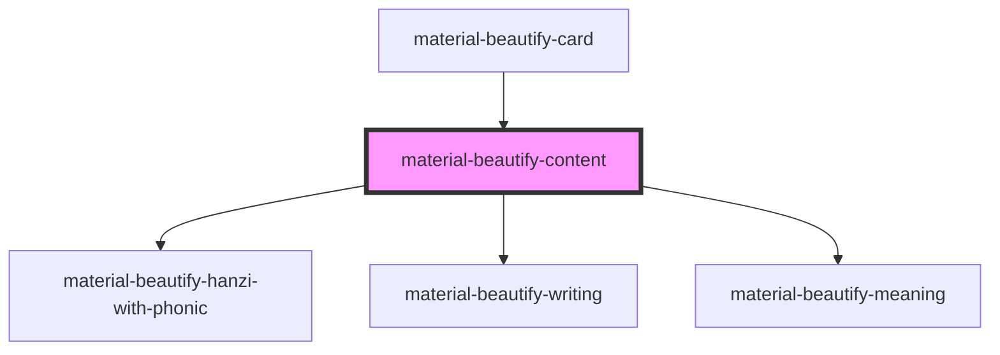

# material-beautify-content

<!-- Auto Generated Below -->

## Properties

| Property            | Attribute            | Description | Type     | Default     |
| ------------------- | -------------------- | ----------- | -------- | ----------- |
| `meaning`           | `meaning`            |             | `string` | `undefined` |
| `orientation`       | `orientation`        |             | `string` | `undefined` |
| `phonic`            | `phonic`             |             | `string` | `undefined` |
| `phonicOrientation` | `phonic-orientation` |             | `string` | `undefined` |
| `secondarySentence` | `secondary-sentence` |             | `string` | `undefined` |
| `secondaryVocab`    | `secondary-vocab`    |             | `string` | `undefined` |
| `sentence`          | `sentence`           |             | `string` | `undefined` |
| `sentenceMeaning`   | `sentence-meaning`   |             | `string` | `undefined` |
| `sentencePhonic`    | `sentence-phonic`    |             | `string` | `undefined` |
| `type`              | `type`               |             | `string` | `undefined` |
| `vocab`             | `vocab`              |             | `string` | `undefined` |

## Dependencies

### Used by

 - [material-beautify-card](../card)

### Depends on

- [material-beautify-hanzi-with-phonic](../hanzi-with-phonic)
- [material-beautify-writing](../writing)
- [material-beautify-meaning](../meaning)

### Graph

----------------------------------------------

*Built with [StencilJS](https://stenciljs.com/)*
