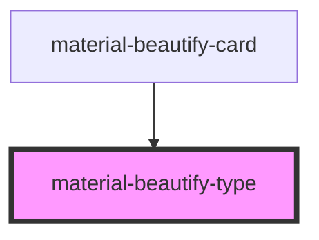

# material-beautify-type

<!-- Auto Generated Below -->

## Properties

| Property           | Attribute            | Description | Type     | Default     |
| ------------------ | -------------------- | ----------- | -------- | ----------- |
| `cardType`         | `card-type`          |             | `string` | `undefined` |
| `primaryHanziType` | `primary-hanzi-type` |             | `string` | `undefined` |

## Dependencies

### Used by

 - [material-beautify-card](../card)

### Graph

----------------------------------------------

*Built with [StencilJS](https://stenciljs.com/)*
