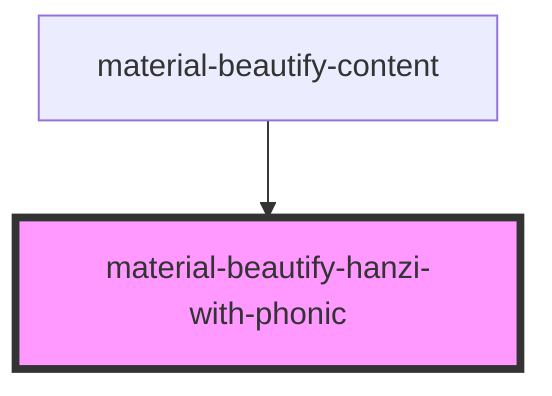

# material-beautify-hanzi-with-phonic

<!-- Auto Generated Below -->

## Properties

| Property            | Attribute            | Description | Type                                           | Default     |
| ------------------- | -------------------- | ----------- | ---------------------------------------------- | ----------- |
| `displayType`       | `display-type`       |             | `DisplayType.PRIMARY \| DisplayType.SECONDARY` | `undefined` |
| `hanzi`             | `hanzi`              |             | `string`                                       | `undefined` |
| `idForStyles`       | `id-for-styles`      |             | `string`                                       | `undefined` |
| `orientation`       | `orientation`        |             | `string`                                       | `undefined` |
| `phonic`            | `phonic`             |             | `string`                                       | `undefined` |
| `phonicOrientation` | `phonic-orientation` |             | `string`                                       | `undefined` |

## Dependencies

### Used by

 - [material-beautify-content](../card-content)

### Graph

----------------------------------------------

*Built with [StencilJS](https://stenciljs.com/)*
