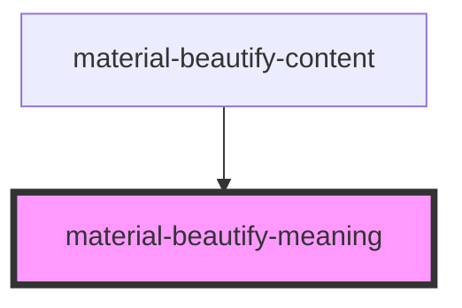

# material-beautify-meaning

<!-- Auto Generated Below -->

## Properties

| Property      | Attribute       | Description | Type     | Default     |
| ------------- | --------------- | ----------- | -------- | ----------- |
| `idForStyles` | `id-for-styles` |             | `string` | `undefined` |
| `meaning`     | `meaning`       |             | `string` | `undefined` |
| `orientation` | `orientation`   |             | `string` | `undefined` |

## Dependencies

### Used by

 - [material-beautify-content](../card-content)

### Graph

----------------------------------------------

*Built with [StencilJS](https://stenciljs.com/)*
