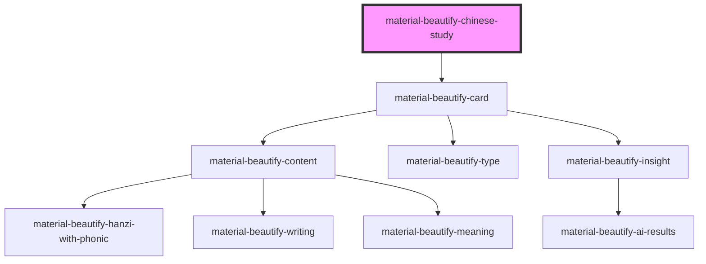

# material-beautify-chinese-study

<!-- Auto Generated Below -->

## Properties

| Property                     | Attribute                      | Description                                                                                                                              | Type      | Default                              |
| ---------------------------- | ------------------------------ | ---------------------------------------------------------------------------------------------------------------------------------------- | --------- | ------------------------------------ |
| `cardOrientation`            | `card-orientation`             | Recognized card orientations: `question` \| `answer`                                                                                     | `string`  | `'question'`                         |
| `cardType`                   | `card-type`                    | Recognized card types: `recognition` \| `sentence` \| `tones` \| `writing` \| `audio` \| `secondary-sentence` \| `secondary-recognition` | `string`  | `'recognition'`                      |
| `forceAutoGeneration`        | `force-auto-generation`        | Option to always generate secondary characters and phonics, ignoring provided overrides                                                  | `boolean` | `false`                              |
| `geminiApiKey`               | `gemini-api-key`               | If AI generated insights are wanted a gemini API key must be provided                                                                    | `string`  | `process.env.GOOGLE_API_KEY \|\| ''` |
| `meaning`                    | `meaning`                      | All English language words allowed                                                                                                       | `string`  | `undefined`                          |
| `numberedPinyin`             | `numbered-pinyin`              | Most forms of numbered pinyin allowed; ignored when `forceAutoGeneration` is true                                                        | `string`  | `undefined`                          |
| `phonicOrientation`          | `phonic-orientation`           | Recognized phonic orientations: `over` \| `next-to`                                                                                      | `string`  | `'next-to'`                          |
| `preferredPhonic`            | `preferred-phonic`             | Recognized phonics: `pinyin` \| `zhuyin`                                                                                                 | `string`  | `'pinyin'`                           |
| `primaryCharacter`           | `primary-character`            | All characters allowed                                                                                                                   | `string`  | `undefined`                          |
| `primaryCharacterSentence`   | `primary-character-sentence`   | All characters allowed                                                                                                                   | `string`  | `undefined`                          |
| `primaryHanziType`           | `primary-hanzi-type`           | Recognized hanzi typoes: 'simplified' \| 'traditional'                                                                                   | `string`  | `'simplified'`                       |
| `secondaryCharacter`         | `secondary-character`          | All characters allowed                                                                                                                   | `string`  | `undefined`                          |
| `secondaryCharacterSentence` | `secondary-character-sentence` | All characters allowed                                                                                                                   | `string`  | `undefined`                          |
| `sentenceMeaning`            | `sentence-meaning`             | All English language words allowed                                                                                                       | `string`  | `undefined`                          |
| `sentenceNumberedPinyin`     | `sentence-numbered-pinyin`     | Most forms of numbered pinyin allowed; ignored when `forceAutoGeneration` is true                                                        | `string`  | `undefined`                          |

## Methods

### `getVersion() => Promise<string>`

#### Returns

Type: `Promise<string>`

## Dependencies

### Depends on

- [material-beautify-card](card)

### Graph

----------------------------------------------

*Built with [StencilJS](https://stenciljs.com/)*
