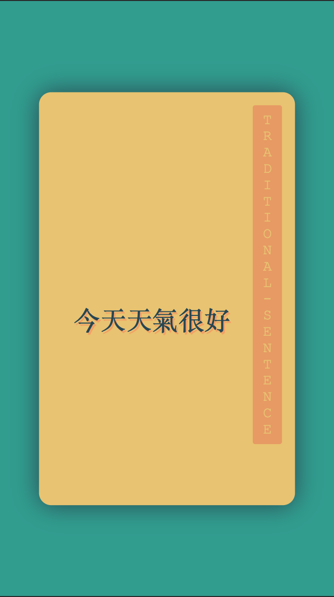
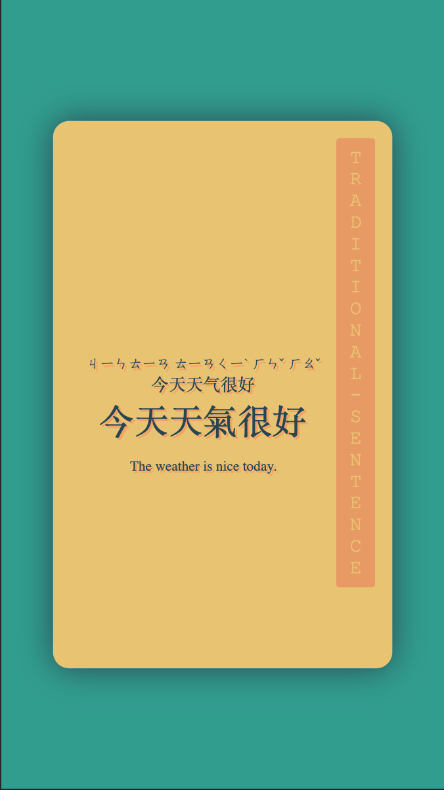
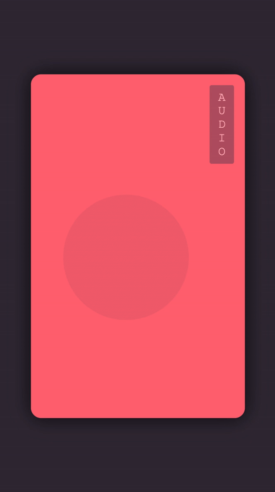
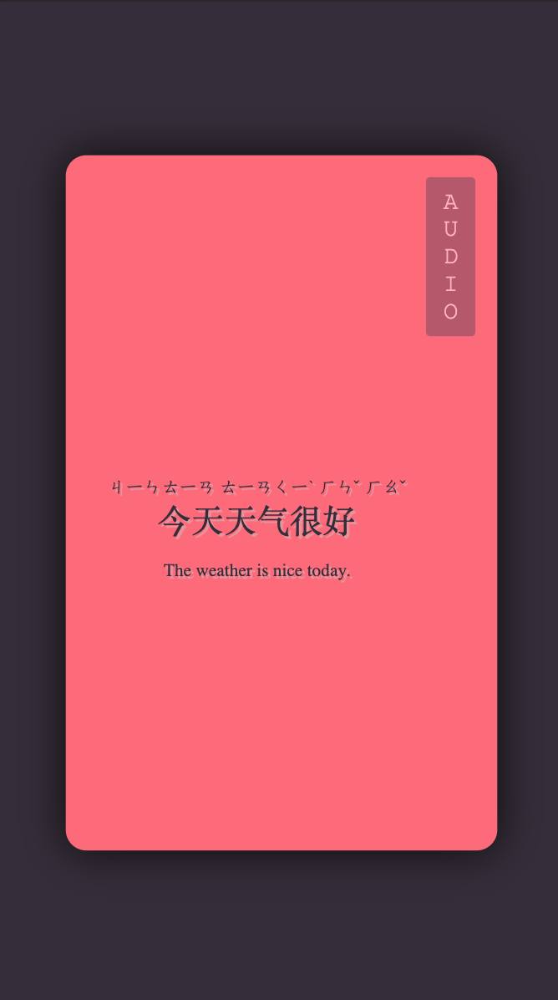
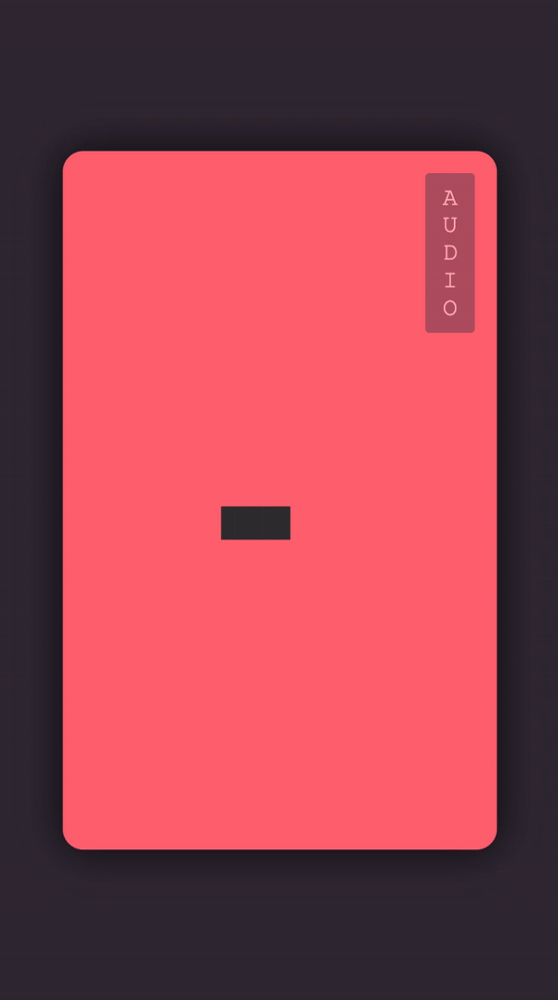

# Purpose

This codebase is a solution for making Chinese study, through Anki, more enjoyable by making the flashcards beautiful.

# Available Card Types And Styling

| Question                                                      | Answer                                                    |
| -----------                                                   | -----------                                               |
|  |  |
|  |  |
|  |  |
|  |  |
|  |  |
|  |  |
|  |  |
|  |  |

# tl;dr

This project can make your Chinese flashcards look nice by copying/pasting a few lines of logic in your Anki template.

A full example of the Front of the card is found below:
```html
<!--Styling may be placed in the Styling Anki tab - but for ease of use let's add it here only-->
<style>
	/*desktop anki*/
	body {
		margin: 0;
	}
	/*ankidroid*/
	#content {
		margin: 0;
	}
</style>

<script>
	// if the custom element material-beautify-chinese-study is not a known element
	//// manually create the html script to import the module so one can be created
	if (!customElements.get('material-beautify-chinese-study')) {
		console.log('Custom element does not exist - Creating script to pull it in');
		var script = document.createElement('script');
		script.setAttribute('id', 'import-script');
		script.setAttribute('type', 'module');
		script.setAttribute('src', 'https://cdn.jsdelivr.net/npm/beautify-chinese-study/dist/beautify-chinese-study/beautify-chinese-study.esm.js');
		document.body.appendChild(script);
	} else {
		console.log('Custom element exists.');
	}

	// locate the custom element material-beautify-chinese-study on the DOM
	//// if it has data - remove everything
	var beautify = document.querySelector('material-beautify-chinese-study');
	if (beautify !== null) {
		beautify.remove();
	}

	// create a brand new material-beautify-chinese-study element and define
	//// its attributes and attribute values
	var beautify = document.createElement('material-beautify-chinese-study');
	beautify.setAttribute('id', 'beautify');
	beautify.setAttribute('simplified', '{{text:Simplified}}');
	beautify.setAttribute('traditional', '{{text:Traditional}}');
	beautify.setAttribute('numbered-pinyin', "{{text:Pinyin.2}}");
	beautify.setAttribute('simplified-sentence', '{{text:SentenceSimplified}}');
	beautify.setAttribute('traditional-sentence', '{{text:SentenceTraditional}}');
	beautify.setAttribute('sentence-numbered-pinyin', "{{text:SentencePinyin.2}}");
	beautify.setAttribute('meaning', "{{text:Meaning}}");
	beautify.setAttribute('card-type', 'recognition');
	beautify.setAttribute('card-orientation', 'question');
	beautify.setAttribute('preferred-phonic', 'zhuyin');
	// add the element to the DOM body
	document.body.appendChild(beautify);
</script>

<!--Always add audio and keep it invisible-->
<div style="display:none;">{{Audio}}{{SentenceAudio}}</div>
```

A full example of the Back of the card is found below:
```html
<!--Styling may be placed in the Styling Anki tab - but for ease of use let's add it here only-->
<style>
	/*desktop anki*/
	body {
		margin: 0;
	}
	/*ankidroid*/
	#content {
		margin: 0;
	}
</style>

<script>
	// if the custom element material-beautify-chinese-study is not a known element
	//// manually create the html script to import the module so one can be created
	if (!customElements.get('material-beautify-chinese-study')) {
		var script = document.createElement('script');
		script.setAttribute('id', 'import-script');
		script.setAttribute('type', 'module');
		script.setAttribute('src', 'https://cdn.jsdelivr.net/npm/beautify-chinese-study/dist/beautify-chinese-study/beautify-chinese-study.esm.js');
		document.body.appendChild(script);
	}

	// since we are on the back of the card the custom element from the front of the card
	//// may have been retained - in instances of AnkiDroid a new webview is created and
	//// the element will need to be recreated from scratch
	var beautify = document.querySelector('#beautify');
	if (!beautify) {
		// probably executing because on AnkiDroid
		// recreating element from scratch
		var beautify = document.createElement('material-beautify-chinese-study');
		beautify.setAttribute('id', 'beautify');
		beautify.setAttribute('simplified', '{{text:Simplified}}');
		beautify.setAttribute('writing', '{{text:Traditional}}');
		beautify.setAttribute('numbered-pinyin', "{{text:Pinyin.2}}");
		beautify.setAttribute('simplified-sentence', '{{text:SentenceSimplified}}');
		beautify.setAttribute('traditional-sentence', '{{text:SentenceTraditional}}');
		beautify.setAttribute('sentence-numbered-pinyin', "{{text:SentencePinyin.2}}");
		beautify.setAttribute('meaning', "{{text:Meaning}}");
		beautify.setAttribute('card-type', 'recognition');
		beautify.setAttribute('card-orientation', 'answer');
		beautify.setAttribute('preferred-phonic', 'zhuyin');
		document.body.appendChild(beautify);
	} else {
		// element already exist
		// redefine verify the card type just for safe keeping
		// redefine the card orientation to display the answer logic
		beautify.setAttribute('card-type', 'recognition');
		beautify.setAttribute('card-orientation', 'answer');
	}
</script>

<!--Always add audio and keep it invisible-->
<div style="display:none;">{{Audio}}{{SentenceAudio}}</div>
```

# How

Anki utilizes web technologies to generate its flashcards. This codebase is using a technology called Web Components that will allow users to only add three html tags to their Anki card templates, and the rest is handled automatically.
* `style`
	* Used to override some top level styling by Anki Desktop and AnkiDroid.
* `script`
	* Used to pull in the main logic that powers this project.
* `material-beautify-chinese-study`
	* The custom html tag that we have created to have beautiful looking Anki Chinese Flashcards.

## Styling

While this project handles most of the styling for the user, there is styling that cannot be overridden from Anki Desktop and AnkiDroid (iOS anki app not tested). Fortunately, by adding a few lines this can be fixed. In the [how](#How) section above, it shows inline CSS to fix this. Those few lines of code may also be placed an Anki's Template Styling section. It is up to the user's preference for the placement of the CSS code. Functionality, it makes no difference where it is located.

# Prerequisites

* Have a Chinese deck in Anki with the following fields (field names do not need to match)
	* Simplified Characters
	* Traditional Characters
	* Meaning In English
	* Numbered Pinyin
* Have the Anki knowledge to set up Card Types (Notes) for the different cards they would like to utilize for their study.

# material-beautify-chinese-study API
	
Please follow the link [here](./src/components/material-beautify-chinese-study/readme.md) to read the full documentation of this element. This documentation is autogenerated and more reliable than handwriting it. 

# Features

Aside from making your flashcards look beautiful, this project has three note-worthy features:
1. Stroke Order Animation
	* On the answer side of the writing cards, the hanzi will animate the stroke order by default.
2. Pleco Integration - mobile only
	* At any time, the user can click the hanzi they are shown and the card will automatically open Pleco (very popular dictionary mobile application).
3. Zhuyin Characters
	* The project can convert your numbered pinyin into zhuyin characters.

# Contributing

Please feel free to make any improvements to the project as you see fit by creating a Pull Request with a detailed description about the `issue` or `enhancement` that your PR will be adding to the project. Please also be sure to add a `how` section that gives a brief overview of how the `issue` or `enhancement` is being done.

If you want to get an idea of what I am thinking of for improvements to the repo, please head over to the [Improvements](#Improvements) section. It's, roughly, listed from most important to least important.

## Please Notice

This project uses Typescript, which means that any code found in the `dist` directory is computer generated and will be trashed and recreated each time the Typescript files are transpiled. If you are new to Typescript please familarize yourself with [the basics](https://code.tutsplus.com/tutorials/typescript-for-beginners-getting-started--cms-29329). I'd hate for someone to spend a long time on a great contribution but be unaware that the Javascript code is computer generated.

## StencilJs

This project is leveraging the StencilJs library to create Web Components in Typescript.

# Current Issues

1. Inputting *accented* pinyin into the *numbered* pinyin attribute has not been tested. I plan to add this because I'm sure most users have accented pinyin, rather than numbered, but this is something I don't have with my decks and haven't spent time on yet.
	* This fix would be simple. Just regex for an accented vowel and if one exists pass the translation logic and output the already accented pinyin to the html.
2. Writing Card Types (Notes) - if it is a single character, it will animate twice. Currently, I'm writing this off as a feature because it's an easy issue to fix but don't mind the repeat.
	* Click event on the characters would be nice to restart animations.

# Improvements

1. A `typing` type card is being developed utilizing Anki's `{{type:FIELD_NAME_HERE}}` functionality.
2. Ease-in animation and a dark background could be added so users don't occasionally see a flash of default background colour when the application is loading.
3. A skeleton card could be created (skeleton cards are essentially a newer version of a loading screen). But, the actual delay is minimal at the moment. 
5. A colour scheme for the web components may be a nice addition. Currently, the colour schemes are defined by question (Anki verbiage is card type or note type) types. Yet, adding a new attribute to define the colour scheme may be a worthwhile feature. This could be achieved, while also having a default scheme for each question type so if the user is okay with the default scheme no additional attributes would need to be set.

----------------
# StencilJs Document That Is Helpful

## Using this component

There are three strategies we recommend for using web components built with Stencil.

The first step for all three of these strategies is to [publish to NPM](https://docs.npmjs.com/getting-started/publishing-npm-packages).

### Quick Guide For Publishing

Assuming you are already logged in, the steps are below:
1. ```bash npm version MANUALLY-INCREMENT-VERSION-NUMBER```
	* Update will be seen in the `package.json` file
2. ```bash npm publish --access public```
	* Verify on npm

### Script tag

- Put a script tag similar to this `<script src='https://unpkg.com/my-component@0.0.1/dist/mycomponent.js'></script>` in the head of your index.html
- Then you can use the element anywhere in your template, JSX, html etc