# Purpose

This codebase is a solution for making Chinese study, through Anki, more enjoyable by making the flashcards more presentable.

# Available Card Types And Styling

| Question                                                      | Answer                                                    |
| -----------                                                   | -----------                                               |
| 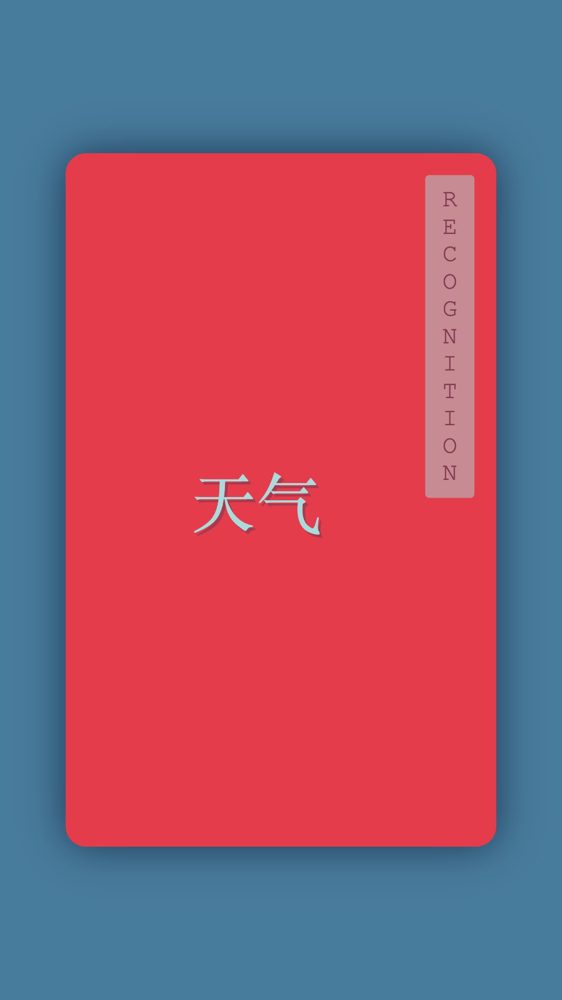 | 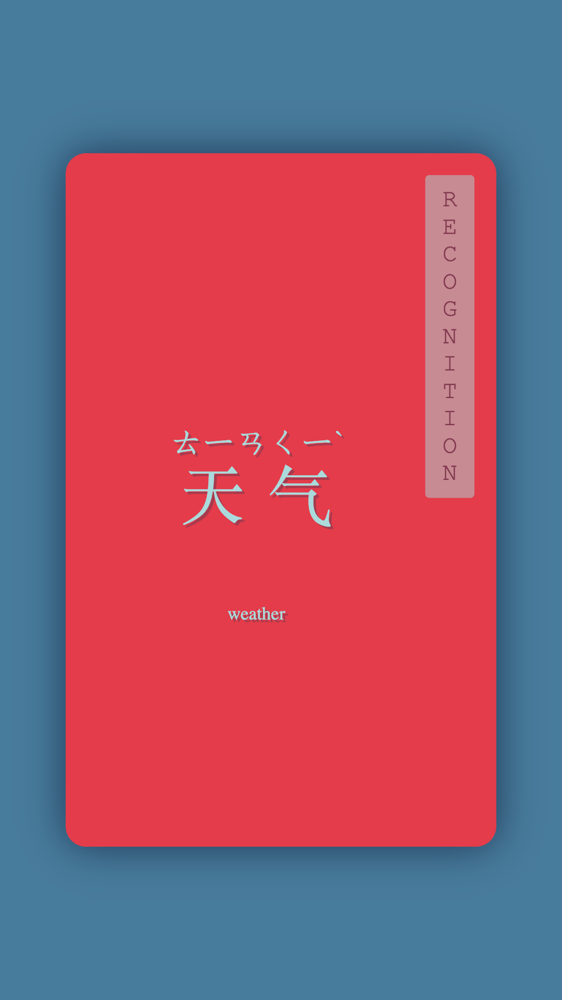 |
| 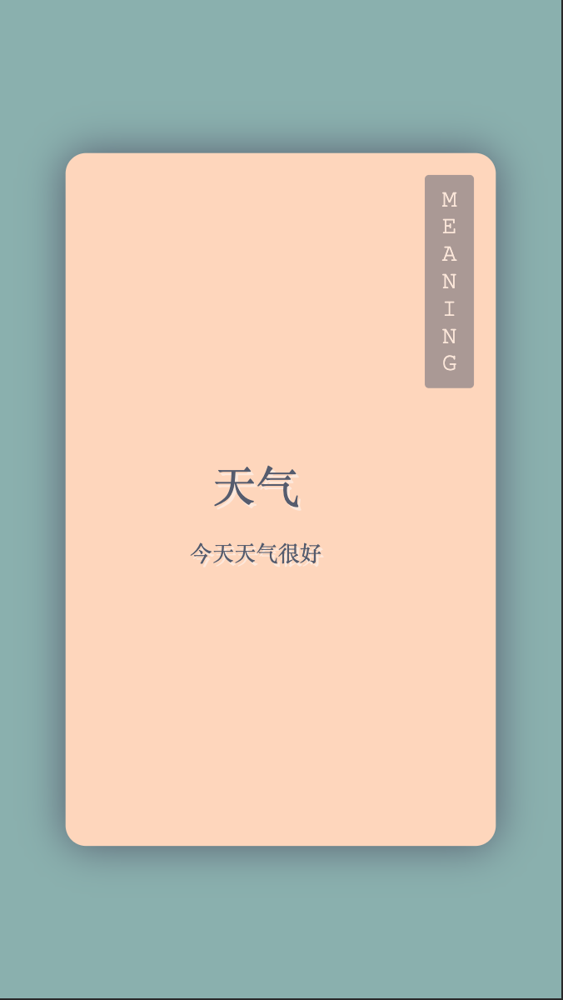 | 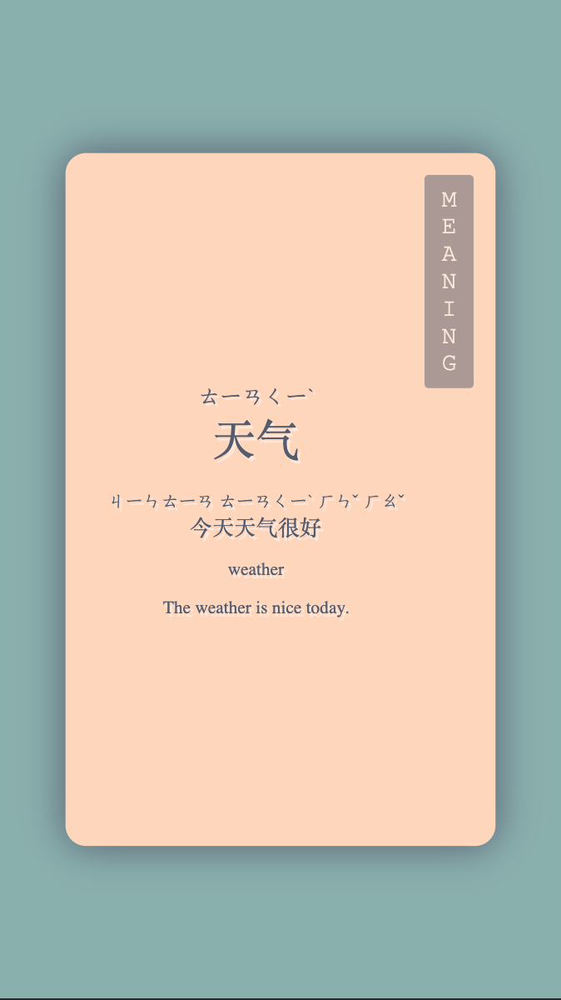 |
| 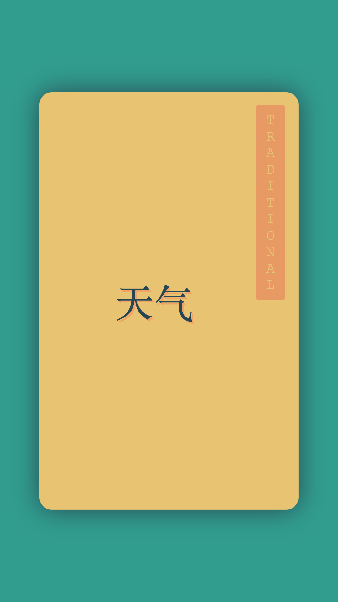 | 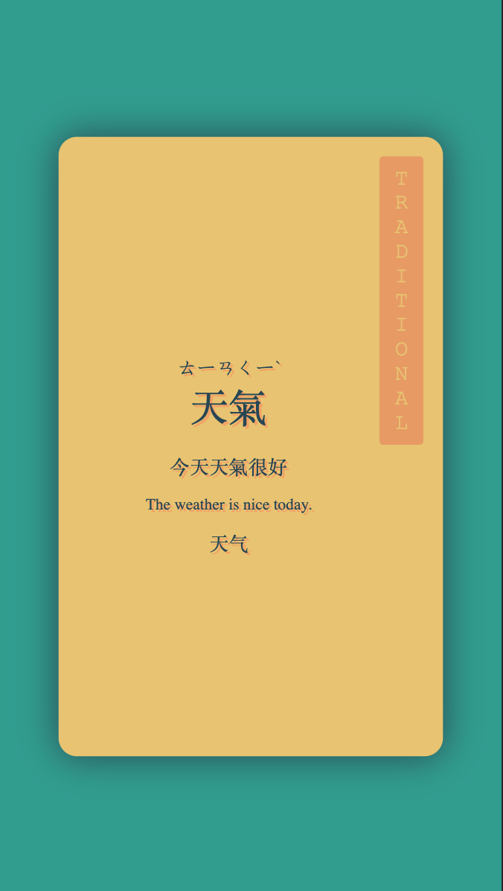 |
| 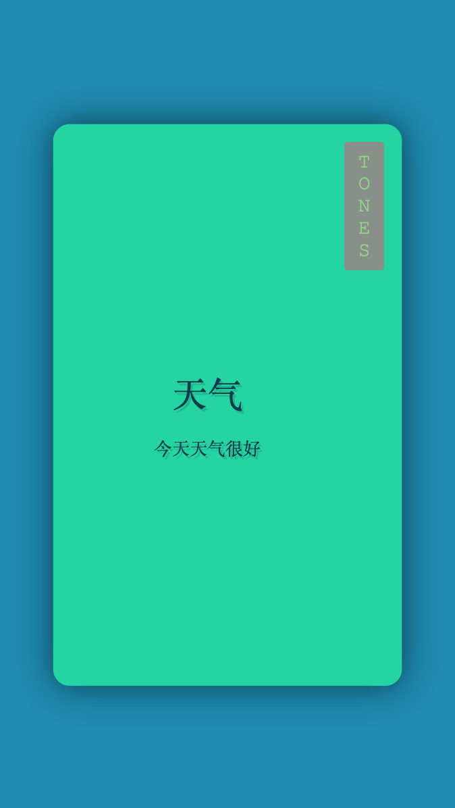 | 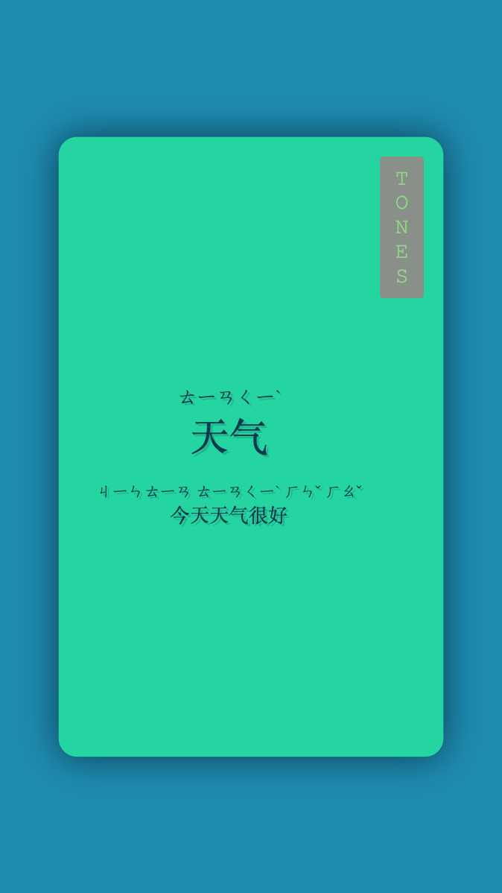 |
| 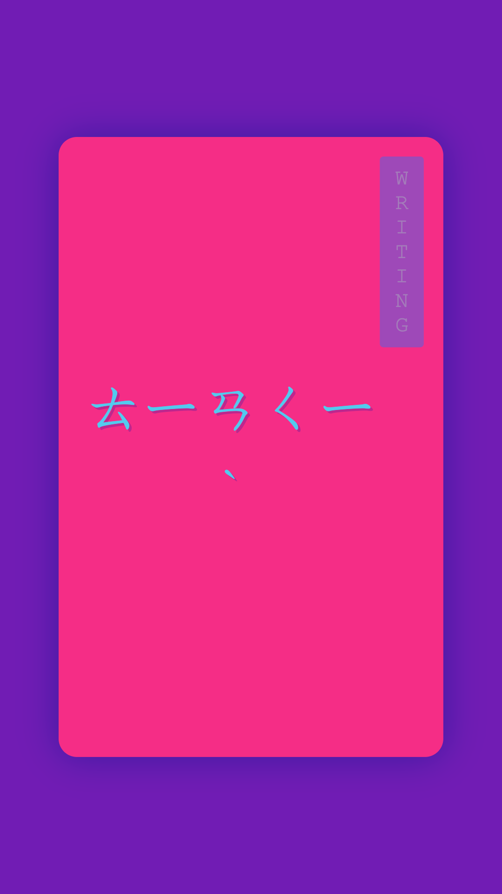 | 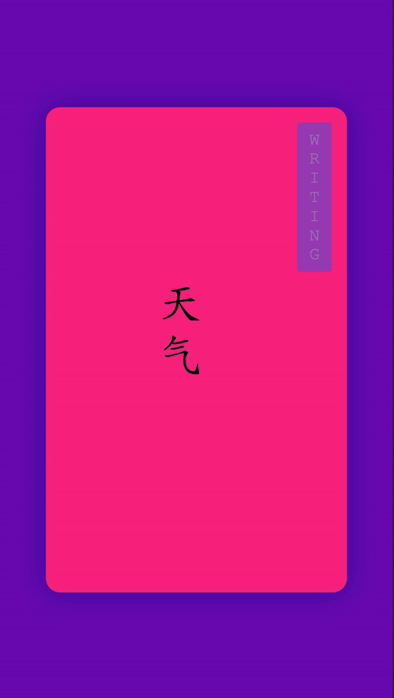 |

# tl;dr

This project can make your chinese cards look cool by copying/pasting code into your Anki template. To do this follow the guide below:
1. Copy the contents of [this file](https://raw.githubusercontent.com/LoganConnor44/anki-templates/master/dist/BeautifyChineseStudy.js)
2. Paste the data into the front and back of your Anki card template.
3. Define the card you want on the front and back for your Anki card template. Example is as followed:
```html
<style>
    /*desktop anki*/
    body {
        margin: 0;
    }

    /*ankidroid*/
    #content {
        margin: 0;
    }
</style>
<beautify-chinese-study style="display: flex; flex-grow: 1; height: 100vh"
	simplified='{{text:Simplified}}'
    traditional='{{text:Traditional}}'
    numberedPinyin='{{text:Pinyin}}'
    meaning='{{text:Meaning}}'
    cardType='tones'
    cardOrientation='question' />

<!--some code omitted-->
```
Click [here](#Full-Code-Example) to see the full example)

# How

Anki utilizes web technologies to generate its flashcards. This codebase is using a web technology called Web Components that will allow users to only write[*](##Caveat) a single html tag in their Anki card templates. An example of this is as followed:
```html
<style>
    /*desktop anki*/
    body {
        margin: 0;
    }

    /*ankidroid*/
    #content {
        margin: 0;
    }
</style>
<beautify-chinese-study style="display: flex; flex-grow: 1; height: 100vh;"
    simplified='天气'
    traditional='天氣'
    numberedPinyin='tian1qi4'
    cardType='recognition'
    meaning='weather'
    cardOrientation='question'
    preferredPhonic='zhuyin' />
```

## Caveat

### One Html Element And Done
The intention of this project is to host the code on a cloud platform, but currently, I have not set this up yet. The work-around is to copy/past the entire contents of [this file](https://raw.githubusercontent.com/LoganConnor44/anki-templates/master/dist/BeautifyChineseStudy.js) into the Anki card template in a `<script>` tag, as seen below:

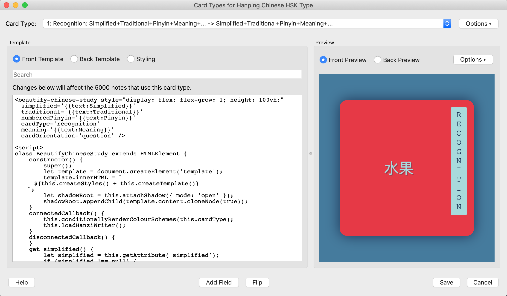

### Styling

While this project handles most of the styling for the user, there is styling that cannot be overridden from Anki Desktop and AnkiDroid (iOS anki app not tested). Fortunately, by adding a few lines this can be fixed. In the [how](#How) section above, it shows inline CSS to fix this. Those few lines of code may also be placing an Anki's Template Styling section. It is up to the user's preference for the placement of the CSS code. Functionality, it makes no difference where it is located.

# Prerequisites

* Have a Chinese deck in Anki with the following fields (field names do not need to match)
    * Simplified Characters
    * Traditional Characters
    * Meaning In English
    * Numbered Pinyin
* Have the Anki knowledge to set up Card Types (Notes) for the different cards they would like to utilize for their study.

# Features

Aside from making your flashcards look pretty, this project has three note-worthy features:
1. Stroke Order Animation
    * On the answer side of the writing cards, the hanzi will animate the stroke order by default.
2. Pleco Integration
    * At any time, the user can click the hanzi they are shown and the card will automatically open Pleco (very popular dictionary mobile application).
3. Zhuyin Characters
    * The project can convert your numbered pinyin into zhuyin characters.

# beautify-chinese-study API
    
The available attributes are as followed for the custom html element.

* simplified
    * Used To Pass In Simplified Hanzi
        * `All Hanzi Accepted`
* traditional
    * Used To Pass In Traditional Hanzi
        * `All Hanzi Accepted`
* meaning
    * Used To Pass In The English Translation
        * `All English Words Accepted`
* numberedPinyin
    * Used To Pass In The Pronunciation Of The Given Hanzi
        * `Most Numbered Pinyin Accepted`
* cardType
    * Used To Define The Desired Question Type
    * Accepted values:
        * `recognition`
        * `meaning`
        * `tones`
        * `traditional`
        *  `writing`
* cardOrientation
    * Used To Define Whether This Card Is A Question Or Answer
    * Accepted values:
        * `question`
        * `answer`
* preferredPhonic - *optional*
    * Used To Define The Preferred Phonetic Type Used - Default is `pinyin`
    * Accepted values:
        * `pinyin`
        * `zhuyin`

# Current Issues

1. Code needs to be copy/pasted into each Card Type (Note). There is a plan to host the web component on a cloud platform that will enable users to pull it in via `<link>`.
2. Accented pinyin has not been tested. I plan to add this because I'm sure most users have accented pinyin, rather than numbered, but this is something I don't have with my decks and haven't spent time on yet.
3. Writing Card Types (Notes) - if it is a single character, it will animate twice. Currently, I'm writing this off as a feature because it's an easy issue to fix but don't mind the repeat.

# Improvements

1. A `typing` type card is being developed utilizing Anki's `{{type:FIELD_NAME_HERE}}` functionality.
2. Ease-in animation and a dark background could be added so users don't occasionally see a flash of default background colour when the application is loading.
3. A skeleton card could be created (skeleton cards are essentially a newer version of a loading screen). But, the actual delay is minimal at the moment. This is a feature that would be better suited after the move to a cloud host is done.

# Full Code Example

```html
<beautify-chinese-study style="display: flex; flex-grow: 1; height: 100vh"
	simplified='{{text:Simplified}}'
            traditional='{{text:Traditional}}'
            numberedPinyin='{{text:Pinyin}}'
            cardType='tones'
            meaning='{{text:Meaning}}'
            cardOrientation='question'
						preferredPhonic='zhuyin' />

<script>

var HanziType;
(function (HanziType) {
    HanziType[HanziType["SIMPLIFIED"] = 0] = "SIMPLIFIED";
    HanziType[HanziType["TRADITIONAL"] = 1] = "TRADITIONAL";
    HanziType[HanziType["SIMPLIFIED_AND_TRADITIONAL"] = 2] = "SIMPLIFIED_AND_TRADITIONAL";
})(HanziType || (HanziType = {}));
var PhoneticType;
(function (PhoneticType) {
    PhoneticType[PhoneticType["PINYIN"] = 0] = "PINYIN";
    PhoneticType[PhoneticType["ZHUYIN"] = 1] = "ZHUYIN";
})(PhoneticType || (PhoneticType = {}));
var Tone;
(function (Tone) {
    Tone[Tone["FIRST"] = 0] = "FIRST";
    Tone[Tone["SECOND"] = 1] = "SECOND";
    Tone[Tone["THIRD"] = 2] = "THIRD";
    Tone[Tone["FORTH"] = 3] = "FORTH";
    Tone[Tone["NEUTRAL"] = 4] = "NEUTRAL";
})(Tone || (Tone = {}));
class Phonetic {
    setTone(number) {
        switch (number) {
            case 1: {
                this.tone = Tone.FIRST;
                break;
            }
            case 2: {
                this.tone = Tone.SECOND;
                break;
            }
            case 3: {
                this.tone = Tone.THIRD;
                break;
            }
            case 4: {
                this.tone = Tone.FORTH;
                break;
            }
            default: {
                this.tone = Tone.NEUTRAL;
                break;
            }
        }
    }
}
class Vowel extends Phonetic {
    constructor(letter) {
        super();
        this.letter = letter;
    }
    getVowel() {
        return this.letter;
    }
    getVowelWithTone() {
        switch (this.letter) {
            case 'a': {
                switch (this.tone) {
                    case Tone.FIRST: {
                        return 'ā';
                    }
                    case Tone.SECOND: {
                        return 'á';
                    }
                    case Tone.THIRD: {
                        return 'ǎ';
                    }
                    case Tone.FORTH: {
                        return 'à';
                    }
                    case Tone.NEUTRAL: {
                        return this.letter;
                    }
                }
            }
            case 'e': {
                switch (this.tone) {
                    case Tone.FIRST: {
                        return 'ē';
                    }
                    case Tone.SECOND: {
                        return 'é';
                    }
                    case Tone.THIRD: {
                        return 'ě';
                    }
                    case Tone.FORTH: {
                        return 'è';
                    }
                    case Tone.NEUTRAL: {
                        return this.letter;
                    }
                }
            }
            case 'i': {
                switch (this.tone) {
                    case Tone.FIRST: {
                        return 'ī';
                    }
                    case Tone.SECOND: {
                        return 'í';
                    }
                    case Tone.THIRD: {
                        return 'ǐ';
                    }
                    case Tone.FORTH: {
                        return 'ì';
                    }
                    case Tone.NEUTRAL: {
                        return this.letter;
                    }
                }
            }
            case 'o': {
                switch (this.tone) {
                    case Tone.FIRST: {
                        return 'ō';
                    }
                    case Tone.SECOND: {
                        return 'ó';
                    }
                    case Tone.THIRD: {
                        return 'ǒ';
                    }
                    case Tone.FORTH: {
                        return 'ò';
                    }
                    case Tone.NEUTRAL: {
                        return this.letter;
                    }
                }
            }
            case 'u': {
                switch (this.tone) {
                    case Tone.FIRST: {
                        return 'ū';
                    }
                    case Tone.SECOND: {
                        return 'ú';
                    }
                    case Tone.THIRD: {
                        return 'ǔ';
                    }
                    case Tone.FORTH: {
                        return 'ù';
                    }
                    case Tone.NEUTRAL: {
                        return this.letter;
                    }
                }
            }
        }
    }
}
class Zhuyin extends Phonetic {
    constructor(pinyin) {
        super();
        this.pinyin = pinyin;
        this.setCharacter();
    }
    getPinyin() {
        return this.pinyin;
    }
    getCharacter() {
        return this.character;
    }
    getCharacterWithTone() {
        switch (this.tone) {
            case Tone.SECOND: {
                return this.character += 'ˊ';
            }
            case Tone.THIRD: {
                return this.character += 'ˇ';
            }
            case Tone.FORTH: {
                return this.character += 'ˋ';
            }
            case Tone.NEUTRAL: {
                return this.character += '˙';
            }
            case Tone.FIRST:
            default: {
                return this.character;
            }
        }
    }
    setCharacter() {
        ;
        const zhuyinMap = {
            a: 'ㄚ',
            ai: 'ㄞ',
            an: 'ㄢ',
            ang: 'ㄤ',
            ao: 'ㄠ',
            ba: 'ㄅㄚ',
            bai: 'ㄅㄞ',
            ban: 'ㄅㄢ',
            bang: 'ㄅㄤ',
            bao: 'ㄅㄠ',
            bei: 'ㄅㄟ',
            ben: 'ㄅㄣ',
            beng: 'ㄅㄥ',
            bi: 'ㄅㄧ',
            bian: 'ㄅㄧㄢ',
            biao: 'ㄅㄧㄠ',
            bie: 'ㄅㄧㄝ',
            bin: 'ㄅㄧㄣ',
            bing: 'ㄅㄧㄥ',
            bo: 'ㄅㄛ',
            bu: 'ㄅㄨ',
            ca: 'ㄘㄚ',
            cai: 'ㄘㄞ',
            can: 'ㄘㄢ',
            cang: 'ㄘㄤ',
            cao: 'ㄘㄠ',
            ce: 'ㄘㄜ',
            cei: 'ㄘㄟ',
            cen: 'ㄘㄣ',
            ceng: 'ㄘㄥ',
            cha: 'ㄔㄚ',
            chai: 'ㄔㄞ',
            chan: 'ㄔㄢ',
            chang: 'ㄔㄤ',
            chao: 'ㄔㄠ',
            che: 'ㄔㄜ',
            chen: 'ㄔㄣ',
            cheng: 'ㄔㄥ',
            chi: 'ㄔ',
            chong: 'ㄔㄨㄥ',
            chou: 'ㄔㄡ',
            chu: 'ㄔㄨ',
            chua: 'ㄔㄨㄚ',
            chuai: 'ㄔㄨㄞ',
            chuan: 'ㄔㄨㄢ',
            chuang: 'ㄔㄨㄤ',
            chui: 'ㄔㄨㄟ',
            chun: 'ㄔㄨㄣ',
            chuo: 'ㄔㄨㄛ',
            ci: 'ㄘ',
            cong: 'ㄘㄨㄥ',
            cou: 'ㄔㄡ',
            cu: 'ㄘㄨ',
            cuan: 'ㄘㄨㄢ',
            cui: 'ㄘㄨㄟ',
            cun: 'ㄘㄨㄣ',
            cuo: 'ㄘㄨㄛ',
            da: 'ㄉㄚ',
            dai: 'ㄉㄞ',
            dan: 'ㄉㄢ',
            dang: 'ㄉㄤ',
            dao: 'ㄉㄠ',
            de: 'ㄉㄜ',
            dei: 'ㄉㄟ',
            den: 'ㄉㄣ',
            deng: 'ㄉㄥ',
            di: 'ㄉㄧ',
            dia: 'ㄉㄧㄚ',
            dian: 'ㄉㄧㄢ',
            diao: 'ㄉㄧㄠ',
            die: 'ㄉㄧㄝ',
            ding: 'ㄉㄧㄥ',
            diu: 'ㄉㄧㄡ',
            dong: 'ㄉㄨㄥ',
            dou: 'ㄉㄡ',
            du: 'ㄉㄨ',
            duan: 'ㄉㄨㄢ',
            dui: 'ㄉㄨㄟ',
            dun: 'ㄉㄨㄣ',
            duo: 'ㄉㄨㄛ',
            e: 'ㄜ',
            ei: 'ㄟ',
            en: 'ㄣ',
            eng: 'ㄥ',
            er: 'ㄦ',
            fa: 'ㄈㄚ',
            fan: 'ㄈㄢ',
            fang: 'ㄈㄤ',
            fei: 'ㄈㄟ',
            fen: 'ㄈㄣ',
            feng: 'ㄈㄥ',
            fo: 'ㄈㄛ',
            fou: 'ㄈㄡ',
            fu: 'ㄈㄨ',
            ga: 'ㄍㄚ',
            gai: 'ㄍㄞ',
            gan: 'ㄍㄢ',
            gang: 'ㄍㄤ',
            gao: 'ㄍㄠ',
            ge: 'ㄍㄜ',
            gei: 'ㄍㄟ',
            gen: 'ㄍㄣ',
            geng: 'ㄍㄥ',
            gong: 'ㄍㄨㄥ',
            gou: 'ㄍㄡ',
            gu: 'ㄍㄨ',
            gua: 'ㄍㄨㄚ',
            guai: 'ㄍㄨㄞ',
            guan: 'ㄍㄨㄢ',
            guang: 'ㄍㄨㄤ',
            gui: 'ㄍㄨㄟ',
            gun: 'ㄍㄨㄣ',
            guo: 'ㄍㄨㄛ',
            ha: 'ㄏㄚ',
            hai: 'ㄏㄞ',
            han: 'ㄏㄢ',
            hang: 'ㄏㄤ',
            hao: 'ㄏㄠ',
            he: 'ㄏㄜ',
            hei: 'ㄏㄟ',
            hen: 'ㄏㄣ',
            heng: 'ㄏㄥ',
            hong: 'ㄏㄨㄥ',
            hou: 'ㄏㄡ',
            hu: 'ㄏㄨ',
            hua: 'ㄏㄨㄚ',
            huai: 'ㄏㄨㄞ',
            huan: 'ㄏㄨㄢ',
            huang: 'ㄏㄨㄤ',
            hui: 'ㄏㄨㄟ',
            hun: 'ㄏㄨㄣ',
            huo: 'ㄏㄨㄛ',
            ji: 'ㄐㄧ',
            jia: 'ㄐㄧㄚ',
            jian: 'ㄐㄧㄢ',
            jiang: 'ㄐㄧㄤ',
            jiao: 'ㄐㄧㄠ',
            jie: 'ㄐㄧㄝ',
            jin: 'ㄐㄧㄣ',
            jing: 'ㄐㄧㄥ',
            jiong: 'ㄐㄩㄥ',
            jiu: 'ㄐㄧㄡ',
            ju: 'ㄐㄩ',
            juan: 'ㄐㄩㄢ',
            jue: 'ㄐㄩㄝ',
            jun: 'ㄐㄩㄣ',
            ka: 'ㄎㄚ',
            kai: 'ㄎㄞ',
            kan: 'ㄎㄢ',
            kang: 'ㄎㄤ',
            kao: 'ㄎㄠ',
            ke: 'ㄎㄜ',
            kei: 'ㄎㄟ',
            ken: 'ㄎㄣ',
            keng: 'ㄎㄥ',
            kong: 'ㄎㄨㄥ',
            kou: 'ㄎㄡ',
            ku: 'ㄎㄨ',
            kua: 'ㄎㄨㄚ',
            kuai: 'ㄎㄨㄞ',
            kuan: 'ㄎㄨㄢ',
            kuang: 'ㄎㄨㄤ',
            kui: 'ㄎㄨㄟ',
            kun: 'ㄎㄨㄣ',
            kuo: 'ㄎㄨㄛ',
            la: 'ㄌㄚ',
            lai: 'ㄌㄞ',
            lan: 'ㄌㄢ',
            lang: 'ㄌㄤ',
            lao: 'ㄌㄠ',
            le: 'ㄌㄜ',
            lei: 'ㄌㄟ',
            leng: 'ㄌㄥ',
            li: 'ㄌㄧ',
            lia: 'ㄌㄧㄚ',
            lian: 'ㄌㄧㄢ',
            liang: 'ㄌㄧㄤ',
            liao: 'ㄌㄧㄠ',
            lie: 'ㄌㄧㄝ',
            lin: 'ㄌㄧㄣ',
            ling: 'ㄌㄧㄥ',
            liu: 'ㄌㄧㄡ',
            lo: 'ㄌㄛ',
            long: 'ㄌㄨㄥ',
            lou: 'ㄌㄡ',
            lu: 'ㄌㄨ',
            luan: 'ㄌㄨㄢ',
            lun: 'ㄌㄨㄣ',
            luo: 'ㄌㄨㄛ',
            lv: 'ㄌㄩ',
            lve: 'ㄌㄩㄝ',
            ma: 'ㄇㄚ',
            mai: 'ㄇㄞ',
            man: 'ㄇㄢ',
            mang: 'ㄇㄤ',
            mao: 'ㄇㄠ',
            me: 'ㄇㄜ',
            mei: 'ㄇㄟ',
            men: 'ㄇㄣ',
            meng: 'ㄇㄥ',
            mi: 'ㄇㄧ',
            mian: 'ㄇㄧㄢ',
            miao: 'ㄇㄧㄠ',
            mie: 'ㄇㄧㄝ',
            min: 'ㄇㄧㄣ',
            ming: 'ㄇㄧㄥ',
            miu: 'ㄇㄧㄡ',
            mo: 'ㄇㄛ',
            mou: 'ㄇㄡ',
            mu: 'ㄇㄨ',
            na: 'ㄋㄚ',
            nai: 'ㄋㄞ',
            nan: 'ㄋㄢ',
            nang: 'ㄋㄤ',
            nao: 'ㄋㄠ',
            ne: 'ㄋㄜ',
            nei: 'ㄋㄟ',
            nen: 'ㄋㄣ',
            neng: 'ㄋㄥ',
            ni: 'ㄋㄧ',
            nian: 'ㄋㄧㄢ',
            niang: 'ㄋㄧㄤ',
            niao: 'ㄋㄧㄠ',
            nie: 'ㄋㄧㄝ',
            nin: 'ㄋㄧㄣ',
            ning: 'ㄋㄧㄥ',
            niu: 'ㄋㄧㄡ',
            nong: 'ㄋㄨㄥ',
            nou: 'ㄋㄨㄡ',
            nu: 'ㄋㄨ',
            nuan: 'ㄋㄨㄢ',
            nuo: 'ㄋㄨㄛ',
            nv: 'ㄋㄩ',
            nve: 'ㄋㄩㄝ',
            o: 'ㄛ',
            ou: 'ㄡ',
            pa: 'ㄆㄚ',
            pai: 'ㄆㄞ',
            pan: 'ㄆㄢ',
            pang: 'ㄆㄤ',
            pao: 'ㄆㄠ',
            pei: 'ㄆㄟ',
            pen: 'ㄆㄣ',
            peng: 'ㄆㄥ',
            pi: 'ㄆㄧ',
            pian: 'ㄆㄧㄢ',
            piao: 'ㄆㄧㄠ',
            pie: 'ㄆㄧㄝ',
            pin: 'ㄆㄧㄣ',
            ping: 'ㄆㄧㄥ',
            po: 'ㄆㄛ',
            pou: 'ㄆㄡ',
            pu: 'ㄆㄨ',
            qi: 'ㄑㄧ',
            qia: 'ㄑㄧㄚ',
            qian: 'ㄑㄧㄢ',
            qiang: 'ㄑㄧㄤ',
            qiao: 'ㄑㄧㄠ',
            qie: 'ㄑㄧㄝ',
            qin: 'ㄑㄧㄣ',
            qing: 'ㄑㄧㄥ',
            qiong: 'ㄑㄩㄥ',
            qiu: 'ㄑㄧㄡ',
            qu: 'ㄑㄩ',
            quan: 'ㄑㄩㄢ',
            que: 'ㄑㄩㄝ',
            qun: 'ㄑㄩㄣ',
            r: 'ㄦ',
            ran: 'ㄖㄢ',
            rang: 'ㄖㄤ',
            rao: 'ㄖㄠ',
            re: 'ㄖㄜ',
            ren: 'ㄖㄣ',
            reng: 'ㄖㄥ',
            ri: 'ㄖ',
            rong: 'ㄖㄨㄥ',
            rou: 'ㄖㄡ',
            ru: 'ㄖㄨ',
            ruan: 'ㄖㄨㄢ',
            rui: 'ㄖㄨㄟ',
            run: 'ㄖㄨㄣ',
            ruo: 'ㄖㄨㄛ',
            sa: 'ㄙㄚ',
            sai: 'ㄙㄞ',
            san: 'ㄙㄢ',
            sang: 'ㄙㄤ',
            sao: 'ㄙㄠ',
            se: 'ㄙㄜ',
            sen: 'ㄙㄣ',
            seng: 'ㄙㄥ',
            sha: 'ㄕㄚ',
            shai: 'ㄕㄞ',
            shan: 'ㄕㄢ',
            shang: 'ㄕㄤ',
            shao: 'ㄕㄠ',
            she: 'ㄕㄜ',
            shei: 'ㄕㄟ',
            shen: 'ㄕㄣ',
            sheng: 'ㄕㄥ',
            shi: 'ㄕ',
            shou: 'ㄕㄡ',
            shu: 'ㄕㄨ',
            shua: 'ㄕㄨㄚ',
            shuai: 'ㄕㄨㄞ',
            shuan: 'ㄕㄨㄢ',
            shuang: 'ㄕㄨㄤ',
            shui: 'ㄕㄨㄟ',
            shun: 'ㄕㄨㄣ',
            shuo: 'ㄕㄨㄛ',
            si: 'ㄙ',
            song: 'ㄙㄨㄥ',
            sou: 'ㄙㄡ',
            su: 'ㄙㄨ',
            suan: 'ㄙㄨㄢ',
            sui: 'ㄙㄨㄟ',
            sun: 'ㄙㄨㄣ',
            suo: 'ㄙㄨㄛ',
            ta: 'ㄊㄚ',
            tai: 'ㄊㄞ',
            tan: 'ㄊㄢ',
            tang: 'ㄊㄤ',
            tao: 'ㄊㄠ',
            te: 'ㄊㄜ',
            tei: 'ㄊㄟ',
            teng: 'ㄊㄥ',
            ti: 'ㄊㄧ',
            tian: 'ㄊㄧㄢ',
            tiao: 'ㄊㄧㄠ',
            tie: 'ㄊㄧㄝ',
            ting: 'ㄊㄧㄥ',
            tong: 'ㄊㄨㄥ',
            tou: 'ㄊㄡ',
            tu: 'ㄊㄨ',
            tuan: 'ㄊㄨㄢ',
            tui: 'ㄊㄨㄟ',
            tun: 'ㄊㄨㄣ',
            tuo: 'ㄊㄨㄛ',
            wa: 'ㄨㄚ',
            wai: 'ㄨㄞ',
            wan: 'ㄨㄢ',
            wang: 'ㄨㄤ',
            wei: 'ㄨㄟ',
            wen: 'ㄨㄣ',
            weng: 'ㄨㄥ',
            wo: 'ㄨㄛ',
            wu: 'ㄨ',
            xi: 'ㄒㄧ',
            xia: 'ㄒㄧㄚ',
            xian: 'ㄒㄧㄢ',
            xiang: 'ㄒㄧㄤ',
            xiao: 'ㄒㄧㄠ',
            xie: 'ㄒㄧㄝ',
            xin: 'ㄒㄧㄣ',
            xing: 'ㄒㄧㄥ',
            xiong: 'ㄒㄩㄥ',
            xiu: 'ㄒㄧㄡ',
            xu: 'ㄒㄩ',
            xuan: 'ㄒㄩㄢ',
            xue: 'ㄒㄩㄝ',
            xun: 'ㄒㄩㄣ',
            ya: 'ㄧㄚ',
            yan: 'ㄧㄢ',
            yang: 'ㄧㄤ',
            yao: 'ㄧㄠ',
            ye: 'ㄧㄝ',
            yi: 'ㄧ',
            yin: 'ㄧㄣ',
            ying: 'ㄧㄥ',
            yo: 'ㄧㄛ',
            yong: 'ㄩㄥ',
            you: 'ㄧㄡ',
            yu: 'ㄩ',
            yuan: 'ㄩㄢ',
            yue: 'ㄩㄝ',
            yun: 'ㄩㄣ',
            za: 'ㄗㄚ',
            zai: 'ㄗㄞ',
            zan: 'ㄗㄢ',
            zang: 'ㄗㄤ',
            zao: 'ㄗㄠ',
            ze: 'ㄗㄜ',
            zei: 'ㄗㄟ',
            zen: 'ㄗㄣ',
            zeng: 'ㄗㄥ',
            zha: 'ㄓㄚ',
            zhai: 'ㄓㄞ',
            zhan: 'ㄓㄢ',
            zhang: 'ㄓㄤ',
            zhao: 'ㄓㄠ',
            zhe: 'ㄓㄜ',
            zhei: 'ㄓㄟ',
            zhen: 'ㄓㄣ',
            zheng: 'ㄓㄥ',
            zhi: 'ㄓ',
            zhong: 'ㄓㄨㄥ',
            zhou: 'ㄓㄡ',
            zhu: 'ㄓㄨ',
            zhua: 'ㄓㄨㄚ',
            zhuai: 'ㄓㄨㄞ',
            zhuan: 'ㄓㄨㄢ',
            zhuang: 'ㄓㄨㄤ',
            zhui: 'ㄓㄨㄟ',
            zhun: 'ㄓㄨㄣ',
            zhuo: 'ㄓㄨㄛ',
            zi: 'ㄗ',
            zong: 'ㄗㄨㄥ',
            zou: 'ㄗㄡ',
            zu: 'ㄗㄨ',
            zuan: 'ㄗㄨㄢ',
            zui: 'ㄗㄨㄟ',
            zun: 'ㄗㄨㄣ',
            zuo: 'ㄗㄨㄛ',
        };
        this.character = zhuyinMap[this.pinyin];
    }
}
class BeautifyChineseStudy extends HTMLElement {
    constructor() {
        super();
        let template = document.createElement('template');
        template.innerHTML = `
			${this.createStyles() + this.createTemplate()}
		`;
        let shadowRoot = this.attachShadow({ mode: 'open' });
        shadowRoot.appendChild(template.content.cloneNode(true));
    }
    connectedCallback() {
        this.conditionallyRenderColourSchemes(this.cardType);
        this.loadHanziWriter();
    }
    disconnectedCallback() {
    }
    get simplified() {
        let simplified = this.getAttribute('simplified');
        if (simplified !== null) {
            simplified.trim();
        }
        return simplified;
    }
    get traditional() {
        let traditional = this.getAttribute('traditional');
        if (traditional !== null) {
            traditional.trim();
        }
        return traditional;
    }
    get numberedPinyin() {
        let numberedPinyin = this.getAttribute('numberedPinyin');
        if (numberedPinyin !== null) {
            numberedPinyin.trim();
        }
        return numberedPinyin;
    }
    get preferredPhonic() {
        let preference = this.getAttribute('preferredPhonic');
        if (preference !== null) {
            preference.trim();
        }
        else {
            preference = 'pinyin';
        }
        return preference;
    }
    get cardType() {
        let cardType = this.getAttribute('cardType');
        if (cardType !== null) {
            cardType.toLowerCase().trim();
        }
        return cardType;
    }
    get cardOrientation() {
        let cardOrientation = this.getAttribute('cardOrientation');
        if (cardOrientation !== null) {
            cardOrientation.toLowerCase().trim();
        }
        return cardOrientation;
    }
    get meaning() {
        let meaning = this.getAttribute('meaning');
        if (meaning !== null) {
            meaning.trim();
        }
        return meaning;
    }
    get phonic() {
        let phonic;
        if (this.preferredPhonic === 'pinyin') {
            phonic = this.pinyin;
        }
        if (this.preferredPhonic === 'zhuyin') {
            phonic = this.zhuyin;
        }
        return phonic;
    }
    get pinyin() {
        return this.damn(PhoneticType.PINYIN, this.numberedPinyin);
    }
    get zhuyin() {
        return this.damn(PhoneticType.ZHUYIN, this.numberedPinyin);
    }
    createStyles() {
        return `
			<style>
				#anki-background {
					display: flex;
					flex-grow: 1;
					padding-left: 3em;
					padding-right: 3em;	
				}
				
				#chinese-card {
					display: flex;
					flex: 1;
					height: 65vh;
					align-items: center;
					align-self: center;
					flex-flow: row nowrap;
					border-radius: 15px;
					padding: 1em;
				}
				
				#chinese-card-content {
					flex: 100 0 0;
					text-align: center;
				}
				
				#chinese-card-type {
					flex: 0 10 0;
					align-self: flex-start;
					writing-mode: vertical-rl;
					text-orientation: upright;
					padding: 0.5em;
					font-family: "Courier New", Courier, monospace;
					overflow-wrap: break-word;
					border-radius: 3px;
					opacity: 50%;
				}
				
				#chinese-card-content > p {
					font-size: xx-large;
				}
				
				#chinese-card-content > #english-meaning {
					font-size: smaller
				}
				
				#chinese-card-type > p {
					font-size: large;
					margin: 0;
					padding: 0;
				}

				#chinese-card-content > p > ruby > a {
					text-decoration: none; 
					color: inherit;
				}
			</style>
		`;
    }
    createTemplate() {
        let template;
        switch (this.cardType) {
            case "traditional":
                if (this.cardOrientation === 'question') {
                    template = `
						<div id='anki-background'>
							<div id='chinese-card'>
								<div id='chinese-card-content'>
									<p>${this.simplified}</p>
								</div>
								<div id='chinese-card-type'>
									<p id='colour-scheme'>${this.cardType.toUpperCase()}</p>
								</div>
							</div>
						</div>
					`;
                }
                if (this.cardOrientation === 'answer') {
                    template = `
						<div id='anki-background'>
							<div id='chinese-card'>
								<div id='chinese-card-content'>
									<p>
										<ruby>
											<a href="plecoapi://x-callback-url/df?hw=${this.traditional}">
												${this.traditional}
											</a>
											<rt id='phonetic-zhuyin'>
												${this.phonic}
											</rt>
										</ruby>
									</p>
									<p>${this.simplified}</p>
								</div>
								<div id='chinese-card-type'>
									<p id="colour-scheme">${this.cardType.toUpperCase()}</p>
								</div>
							</div>
						</div>
					`;
                }
                break;
            case "recognition":
                if (this.cardOrientation === 'question') {
                    template = `
						<div id='anki-background'>
							<div id='chinese-card'>
								<div id='chinese-card-content'>
									<p>${this.simplified}</p>
								</div>
								<div id='chinese-card-type'>
									<p id='colour-scheme'>${this.cardType.toUpperCase()}</p>
								</div>
							</div>
						</div>
					`;
                }
                if (this.cardOrientation === 'answer') {
                    template = `
						<div id='anki-background'>
							<div id='chinese-card'>
								<div id='chinese-card-content'>
									<p>
										<ruby>
											<a href="plecoapi://x-callback-url/df?hw=${this.simplified}">
												${this.simplified}
											</a>
											<rt class='phonetic-zhuyin'>
												${this.phonic}
											</rt>
										</ruby>
									</p>
									<p id="english-meaning">${this.meaning}</p>
								</div>
								<div id='chinese-card-type'>
									<p id="colour-scheme">${this.cardType.toUpperCase()}</p>
								</div>
							</div>
						</div>
					`;
                }
                break;
            case 'meaning':
                if (this.cardOrientation === 'question') {
                    template = `
						<div id='anki-background'>
							<div id='chinese-card'>
								<div id='chinese-card-content'>
									<p>${this.simplified}</p>
								</div>
								<div id='chinese-card-type'>
									<p id='colour-scheme'>${this.cardType.toUpperCase()}</p>
								</div>
							</div>
						</div>
					`;
                }
                if (this.cardOrientation === 'answer') {
                    template = `
						<div id='anki-background'>
							<div id='chinese-card'>
								<div id='chinese-card-content'>
									<p>
										<a style="text-decoration:none; color: inherit;" href="plecoapi://x-callback-url/df?hw=${this.simplified}">
											${this.simplified}
										</a>
										<br>
										<br>
										<p id="english-meaning">${this.meaning}</p>
									</p>
								</div>
								<div id='chinese-card-type'>
									<p id='colour-scheme'>${this.cardType.toUpperCase()}</p>
								</div>
							</div>
						</div>
					`;
                }
                break;
            case 'tones':
                if (this.cardOrientation === 'question') {
                    template = `
						<div id='anki-background'>
							<div id='chinese-card'>
								<div id='chinese-card-content'>
									<p>
										<ruby>
											${this.simplified}
										</ruby>
									</p>
								</div>
								<div id='chinese-card-type'>
									<p id='colour-scheme'>${this.cardType.toUpperCase()}</p>
								</div>
							</div>
						</div>
					`;
                }
                if (this.cardOrientation === 'answer') {
                    template = `
						<div id='anki-background'>
							<div id='chinese-card'>
								<div id='chinese-card-content'>
									<p>
										<ruby>
											<a href="plecoapi://x-callback-url/df?hw=${this.simplified}">
												${this.simplified}
											</a>
											<rt id='phonetic-zhuyin'>
												${this.phonic}
											</rt>
										</ruby>
									</p>
								</div>
								<div id='chinese-card-type'>
									<p id='colour-scheme'>${this.cardType.toUpperCase()}</p>
								</div>
							</div>
						</div>
					`;
                }
                break;
            case 'writing':
                if (this.cardOrientation === 'question') {
                    template = `
						<div id='anki-background'>
							<div id='chinese-card'>
							<div id='chinese-card-content'>
								<p id='phonetic-zhuyin'>
									${this.phonic}
								</p>
								</div>
							<div id='chinese-card-type'>
								<p id='colour-scheme'>${this.cardType.toUpperCase()}</p>
							</div>
							</div>
						</div>
					`;
                }
                if (this.cardOrientation === 'answer') {
                    template = `
						<div id='anki-background'>
							<div id='chinese-card'>
								<div id='chinese-card-content'>
									<p>
										<a href="plecoapi://x-callback-url/df?hw=${this.simplified}">
											<div id='stroke-order'></div>
										</a>
										<br>
										<br>
									</p>
								</div>
								<div id='chinese-card-type'>
									<p id='colour-scheme'>${this.cardType.toUpperCase()}</p>
								</div>
							</div>
						</div>
					`;
                }
                break;
        }
        return template;
    }
    conditionallyRenderColourSchemes(questionType) {
        let body = this.shadowRoot.querySelector('#anki-background');
        let card = this.shadowRoot.querySelector('#chinese-card');
        let cardType = this.shadowRoot.querySelector('#chinese-card-type');
        let cardContent = this.shadowRoot.querySelector('#chinese-card-content');
        switch (questionType) {
            case 'traditional':
                var darkest = '#264653';
                var darker = '#2A9D8F';
                var neutral = '#E76F51';
                var brighter = '#F4A261';
                var brightest = '#E9C46A';
                body.style.backgroundColor = darker;
                card.style.color = darkest;
                card.style.backgroundColor = brightest;
                card.style.boxShadow = '0px 0px 30px ' + darkest;
                cardType.style.color = brightest;
                cardType.style.backgroundColor = neutral;
                cardContent.style.textShadow = '2px 2px ' + brighter;
                break;
            case 'tones':
                var darkest = '#073B4C';
                var darkestRBG = 'rgb(7, 59, 76, 0.2)';
                var darker = '#118AB2';
                var neutral = '#EF476F';
                var brighter = '#06D6A0';
                var brightest = '#FFD166';
                var brightestRBG = 'rgb(255, 209, 102, 0.5)';
                body.style.backgroundColor = darker;
                card.style.color = darkest;
                card.style.backgroundColor = brighter;
                card.style.boxShadow = '0px 0px 30px ' + darkest;
                cardType.style.color = brightest;
                cardType.style.backgroundColor = neutral;
                cardContent.style.textShadow = '2px 2px ' + darkestRBG;
                break;
            case 'writing':
                var darkest = '#3A0CA3';
                var darkestRBG = 'rgb(58, 12, 163, 0.3)';
                var darker = '#7209B7';
                var neutral = '#4361EE';
                var brighter = '#4CC9F0';
                var brightest = '#F72585';
                body.style.backgroundColor = darker;
                card.style.color = brighter;
                card.style.backgroundColor = brightest;
                card.style.boxShadow = '0px 0px 30px ' + darkest;
                cardType.style.color = brighter;
                cardType.style.backgroundColor = neutral;
                cardContent.style.textShadow = '2px 2px ' + darkestRBG;
                break;
            case 'recognition':
                var darkest = '#1D3557';
                var darkestRGB = 'rgb(29, 53, 87, 0.3)';
                var darker = '#E63946';
                var neutral = '#457B9D';
                var brighter = '#A8DADC';
                var brightest = '#F1FAEE';
                body.style.backgroundColor = neutral;
                card.style.color = brighter;
                card.style.backgroundColor = darker;
                card.style.boxShadow = '0px 0px 30px ' + darkest;
                cardType.style.color = darkest;
                cardType.style.backgroundColor = brighter;
                cardContent.style.textShadow = '2px 2px ' + darkestRGB;
                break;
            case 'meaning':
                var darkest = '#555B6E';
                var darker = '#89B0AE';
                var neutral = '#FFD6BA';
                var brighter = '#BEE3DB';
                var brightest = '#FAF9F9';
                var brightestRGB = 'rgb(250, 249, 249, 0.5)';
                body.style.backgroundColor = darker;
                card.style.color = darkest;
                card.style.backgroundColor = neutral;
                card.style.boxShadow = '0px 0px 30px ' + darkest;
                cardType.style.color = brightest;
                cardType.style.backgroundColor = darkest;
                cardContent.style.textShadow = '2px 2px ' + brightestRGB;
                break;
        }
    }
    ;
    damn(phonicType, fuckIt) {
        const isPinyin = (value) => toBoolean(value.search(/^[a-zA-Z0-9\s]*$/));
        const containsNumerics = (value) => toBoolean(value.search(/\d/));
        const parseTone = (value) => value === ' ' || value === '' ? 5 : parseInt(value);
        const toBoolean = (value) => value >= 0 ? true : false;
        const replaceVowelWithAccentedVowel = (value, accentedVowel) => {
            const valueReversed = value.split('').reverse().join('');
            const valueWithAccentReversed = valueReversed.replace(accentedVowel.getVowel(), accentedVowel.getVowelWithTone());
            return valueWithAccentReversed.split('').reverse().join('');
        };
        const createAppropriateVowelWithAccent = (valueArray, toneNumber) => {
            let vowels = new Array();
            vowels[0] = new Vowel('a');
            vowels[1] = new Vowel('e');
            vowels[2] = new Vowel('i');
            vowels[3] = new Vowel('o');
            vowels[4] = new Vowel('u');
            let vowelToBeAccented = '';
            vowels.forEach(vowel => {
                valueArray.forEach((x) => {
                    if (x === vowel.getVowel() && vowelToBeAccented === '') {
                        vowelToBeAccented = vowel.getVowel();
                    }
                });
            });
            const accentedVowel = new Vowel(vowelToBeAccented);
            accentedVowel.setTone(toneNumber);
            return accentedVowel;
        };
        const retrieveVowelsBeforeNumber = (value) => {
            const vowelPattern = /([a|e|i|o|u])/i;
            const regEx = new RegExp(vowelPattern);
            const valueArrayReversed = value.split('').reverse();
            let vowelsPresent = new Array();
            let initialConsonantsPassed = false;
            valueArrayReversed.forEach(x => {
                if (vowelsPresent.length > 0) {
                    initialConsonantsPassed = true;
                }
                if (regEx.test(x) || !initialConsonantsPassed) {
                    vowelsPresent.push(x);
                }
            });
            return vowelsPresent.reverse();
        };
        const replaceNumberWithAccentedVowel = (value, toneNumber) => {
            const vowelsImmediatelyBeforeNumber = retrieveVowelsBeforeNumber(value);
            const vowelAccented = createAppropriateVowelWithAccent(vowelsImmediatelyBeforeNumber, toneNumber);
            return replaceVowelWithAccentedVowel(value, vowelAccented);
        };
        /**
         * Sets the tone for a syllable even if a light tone syllable is right up against another valid toned syllable.
         *
         * @param phonic Zhuyin The new zhuyin character converted from pinyin.
         * @param letters string The remaining pinyin letters after the zhuyin has been created.
         * @param tone number The extracted tone number that should only be applied to the last zhuyin.
         */
        const setToneWithPossibleMalformedPinyinHandling = (phonic, letters, tone) => {
            if (letters === '') {
                phonic.setTone(tone);
            }
            else {
                phonic.setTone(5);
            }
        };
        const replaceNumberedRomanLettersWithZhuyin = (letters, tone) => {
            let returnValue = '';
            const maxIterations = 25;
            let iterationCounter = 1;
            while (letters !== '' && iterationCounter < maxIterations) {
                for (let i = letters.length; i > -1; i--) {
                    const phonic = new Zhuyin(letters.substring(0, i).toLowerCase());
                    if (phonic.getCharacter() !== undefined) {
                        letters = letters.substring(phonic.getPinyin().length);
                        setToneWithPossibleMalformedPinyinHandling(phonic, letters, tone);
                        returnValue += phonic.getCharacterWithTone();
                        break;
                    }
                }
                iterationCounter++;
            }
            return returnValue;
        };
        const convertNumberedPinyinTo = (phoneticType, value) => {
            let convertedValue = '';
            const minimumOneLetterCaseInsensitive = new RegExp(/([a-zA-Z]{1,})/);
            const numbersOneThroughFiveOrSpaceIndicatingLightTone = new RegExp(/([1-5]|\s*)/);
            const zeroOrOneSpaceCharacterNonToneRelated = new RegExp(/(\s*)/);
            const finalRegEx = new RegExp(minimumOneLetterCaseInsensitive.source +
                numbersOneThroughFiveOrSpaceIndicatingLightTone.source +
                zeroOrOneSpaceCharacterNonToneRelated.source);
            let results;
            while ((results = finalRegEx.exec(value)) !== null) {
                value = value.substring(results.index + results[0].length);
                const originalText = results[0];
                const romanLetters = results[1];
                const tone = parseTone(results[2]);
                const spaceCharacter = results[3];
                let phonic;
                if (phoneticType === PhoneticType.ZHUYIN) {
                    phonic = replaceNumberedRomanLettersWithZhuyin(romanLetters, tone);
                }
                if (phoneticType === PhoneticType.PINYIN) {
                    phonic = replaceNumberWithAccentedVowel(romanLetters, tone);
                }
                convertedValue += phonic + spaceCharacter;
            }
            return convertedValue;
        };
        const processNumberedPinyin = (phoneticType, value) => {
            return convertNumberedPinyinTo(phoneticType, value);
        };
        const hanziToPhoneticCharacters = (phoneticType, value) => {
            let result = '';
            value = value.trim();
            value = value.replace(/['.!?]/g, '');
            if (isPinyin(value)) {
                result = processNumberedPinyin(phoneticType, value);
            }
            return result;
        };
        return hanziToPhoneticCharacters(phonicType, fuckIt);
    }
    createStrokeOrderCharacter() {
        let delayBetweenAnimations = 500;
        let characters = this.simplified.split('');
        let drawingArea = this.shadowRoot.querySelector('#stroke-order');
        let strokeOrderCharacters = [];
        for (var i = 0; i < characters.length; i++) {
            let idName = 'character-' + i;
            let node = document.createElement('div');
            node.id = idName;
            drawingArea.appendChild(node);
            let strokeOrderCharacter = HanziWriter.create(node, characters[i], {
                strokeColor: '#000000',
                width: 50,
                height: 50,
                padding: 1,
                delayBetweenStrokes: 500,
            });
            strokeOrderCharacters.push(strokeOrderCharacter);
        }
        const animateNextCharacter = (current, hanziCharacters) => {
            const currentCharacter = hanziCharacters[current];
            const nextId = current + 1;
            const nextCharacter = hanziCharacters[nextId];
            const nextNextId = current + 2;
            const nextNextCharacter = hanziCharacters[nextNextId];
            const isLastCharacter = () => nextCharacter === undefined;
            const isNextCharacterTheLastCharacter = () => nextNextCharacter === undefined;
            setTimeout(() => {
                if (isLastCharacter()) {
                    currentCharacter.animateCharacter();
                }
                else {
                    if (isNextCharacterTheLastCharacter()) {
                        nextCharacter.animateCharacter();
                    }
                    else {
                        nextCharacter.animateCharacter({
                            onComplete: () => animateNextCharacter(nextId, hanziCharacters)
                        });
                    }
                }
            }, delayBetweenAnimations);
        };
        const animateFirstCharacterOnly = () => {
            let firstCharacter = strokeOrderCharacters[0];
            firstCharacter.animateCharacter({
                onComplete: () => animateNextCharacter(0, strokeOrderCharacters)
            });
        };
        setTimeout(() => {
            animateFirstCharacterOnly();
        }, delayBetweenAnimations + delayBetweenAnimations);
    }
    ;
    loadHanziWriter() {
        let script = document.createElement('script');
        script.setAttribute('type', 'text/javascript');
        script.setAttribute('src', 'https://cdn.jsdelivr.net/npm/hanzi-writer@2.2/dist/hanzi-writer.min.js');
        script.addEventListener('load', () => {
            this.createStrokeOrderCharacter();
        });
        this.shadowRoot.appendChild(script);
    }
    ;
}
const beautifyChineseStudy = customElements.get('beautify-chinese-study');
if (!beautifyChineseStudy) {
    customElements.define('beautify-chinese-study', BeautifyChineseStudy);
}


</script>
```