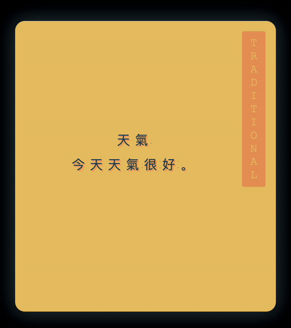
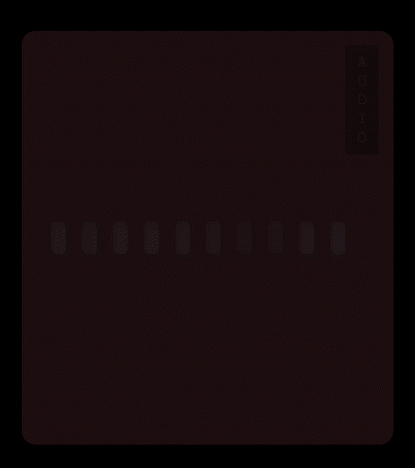

# Purpose

This is a project for making Chinese study, through Anki, more enjoyable by automatically styling the flashcards and providing convenience features. This project enables one to focus more on studying rather than perfecting their form of studying.

# Available Card Types

> The below is showcasing various phonic types and orientations. This may be configured to your preferred study needs. The variety shown is for demonstration purposes.

|                             Recognition                             |                           Sentence                            |
| :-----------------------------------------------------------------: | :-----------------------------------------------------------: |
|  |  |

|                          Tones                          |                                  Secondary Recognition                                  |
| :-----------------------------------------------------: | :-------------------------------------------------------------------------------------: |
|  |  |

|                                Secondary Sentence                                 |                          Audio                          |
| :-------------------------------------------------------------------------------: | :-----------------------------------------------------: |
|  |  |

|                                                                                 Writing (Under Construction)                                                                                 |
| :------------------------------------------------------------------------------------------------------------------------------------------------------------------------------------------: |
| This one has regressed too much. It was left un-maintained after several upgrades and isn't worth showing in its current state. Works fine in prior versions if you are eager to utilize it. |

# tl;dr

Whether your study involves simplified or traditional characters, this project can make Chinese flashcards look nice by copying/pasting [a few lines of logic](#code-snippets) in your Anki template. It can also auto-magically generate some data, please go [here](./output/components/material-beautify-chinese-study/readme.md) to see what is available.

Try it out now by navigating to the [jsFiddle page](#JSFiddle), or follow the instructions below to set this up within your own installation of Anki.

1. Copy and paste the below [code snippets](#code-snippets) into their respective card templates
2. Exchange the default value of `YOUR_FIELD_NAME` with the names defined in your deck (see {{text:YOUR_FIELD_NAME}})
3. Decide which card type you want to create and update that attribute value as well.

# Convenience Features

Aside from making your flashcards look beautiful, this project has a few note-worthy features:

1. Simplified And/Or Traditional Character Support

    - This project has a concept which enables the user to define which character type they would like to make their 'primary' character set. A user may also define an optional 'secondary' character set or have one automatically generated from their 'primary' character.
        - This enables a user to become familiar with both character types as it is be helpful to be able to understand all forms and permutations that written language may take.

1. Automatic Secondary Character Generation

    - The user will define a 'primary' character set and a secondary character set may be autogenerated to expand the learner's study.
        - e.g.: A user may set their primary character as Simplified and a Traditional form of that card can be automatically generated.

1. Pinyin Or Zhuyin Phonic Support

    - This project allows a user to define which phonic type they would like to utilize in their study. This feature is _not_ limited by the user's 'primary' character type. Users have the ability to 'mismatch' uncommon character and phonic type combinations. Such as Simplified and Zhuyin.
        - Please Note: If a user _does not_ want autogenerated zhuyin values, the equivalent pinyin phonic must be the source phonic that is defined. With this limitation, it is recommended to set the web component to always force autogeneration.

1. Automatic Phonic Generation

    - As long as a 'primary' character is present and the chosen phonic field is blank, or omitted, from the web component, an automated one will be generated.
        - Setting preferred phonic to pinyin (default value) will generate accented pinyin
        - Setting preferred phonic to zhuyin will generate the expected value of bopomofo characters
    - Users may also force all phonic values, even if values are found in their Anki data. This is recommended.

1. Dictionary Integration
    - At any time, the user can click the hanzi that is shown and the card will automatically open either within Pleco (on mobile) or Hanzii.net (on desktop)
        - Pleco must be pre-installed on your mobile device for this to work as expected.
1. Stroke Order Animation - Under Construction
    - On the answer side of the writing cards, the hanzi will animate the stroke order by default.

# Code Snippets

## Front

A full example of the Front of a recognition card is found below:

```html
<!--Styling may be placed in the Styling Anki tab - but for ease of use let's add it here only-->
<style>
	/*desktop anki*/
	body {
		margin: 0;
	}
	/*ankidroid*/
	#content {
		margin: 0;
	}
</style>

<script>
	// if the custom element material-beautify-chinese-study is not a known element
	//// manually create the html script to import the module so the browser has
	//// the necessary logic to create element
	if (!customElements.get('material-beautify-chinese-study')) {
		console.log('Custom element does not exist - Creating script to pull it in');
		var script = document.createElement('script');
		script.setAttribute('id', 'import-script');
		script.setAttribute('type', 'module');
		// this will retrieve the newest, bleeding edge version of the package
		// doing this could cause issues if something in the package is updated and the older
		//// version no longer exists
		// one solution is to require a specific version by adding @VERSION-NUMBER like the example below
		//// https://cdn.jsdelivr.net/npm/beautify-chinese-study@1.1.48/dist/beautify-chinese-study/beautify-chinese-study.esm.js
		// versions can be viewed here https://www.npmjs.com/package/beautify-chinese-study
		script.setAttribute('src', 'https://cdn.jsdelivr.net/npm/beautify-chinese-study/dist/beautify-chinese-study/beautify-chinese-study.esm.js');
		document.body.appendChild(script);
	} else {
		console.log('Custom element exists.');
	}

	// locate the custom element material-beautify-chinese-study on the DOM
	//// if it has data - remove everything
	var beautify = document.querySelector('material-beautify-chinese-study');
	if (beautify !== null) {
		beautify.remove();
	}

	// create a brand new material-beautify-chinese-study element and define
	//// its attributes and attribute values
	// IMPORTANT - the text below that contains {{text:YOUR_FIELD_NAME}} is meant to be exchanged
	//// with the field names on your Anki card fields
	//// eg if the english translation field on your Anki card is called English the value you type below
	//// would be
	//// beautify.setAttribute('meaning', "{{text:English}}")
	// Remove the above references to {{text:YOUR_FIELD_NAME}} and {{text:EngLish}}
	//// even though they are comments - Anki will still see this as an error
	var beautify = document.createElement('material-beautify-chinese-study');
	beautify.setAttribute('id', 'beautify');
	beautify.setAttribute('primary-character', `{{text:YOUR_FIELD_NAME}}`);
	beautify.setAttribute('secondary-character', `{{text:YOUR_FIELD_NAME}}`);
	beautify.setAttribute('numbered-pinyin', `{{text:YOUR_FIELD_NAME}}`);
	beautify.setAttribute('primary-character-sentence', `{{text:YOUR_FIELD_NAME}}`);
	beautify.setAttribute('secondary-character-sentence', `{{text:YOUR_FIELD_NAME}}`);
	beautify.setAttribute('sentence-numbered-pinyin', `{{text:YOUR_FIELD_NAME}}`);
	beautify.setAttribute('meaning', `{{text:YOUR_FIELD_NAME}}`);
	beautify.setAttribute('card-type', 'recognition');
	beautify.setAttribute('card-orientation', 'question');
	beautify.setAttribute('preferred-phonic', 'zhuyin');
	// add the element to the DOM body
	document.body.appendChild(beautify);
</script>

<!--Always add audio and keep it invisible-->
<div style="display:none;">{{Audio}}{{SentenceAudio}}</div>
```

## Back

A full example of the Back of a recognition card is found below:

```html
<!--Styling may be placed in the Styling Anki tab - but for ease of use let's add it here only-->
<style>
	/*desktop anki*/
	body {
		margin: 0;
	}
	/*ankidroid*/
	#content {
		margin: 0;
	}
</style>

<script>
	// if the custom element material-beautify-chinese-study is not a known element
	//// manually create the html script to import the module so the browser has
	//// the necessary logic to create element
	if (!customElements.get('material-beautify-chinese-study')) {
		var script = document.createElement('script');
		script.setAttribute('id', 'import-script');
		script.setAttribute('type', 'module');
		// this will retrieve the newest, bleeding edge version of the package
		// doing this could cause issues if something in the package is updated and the older
		//// version no longer exists
		// one solution is to require a specific version by adding @VERSION-NUMBER like the example below
		//// https://cdn.jsdelivr.net/npm/beautify-chinese-study@1.1.48/dist/beautify-chinese-study/beautify-chinese-study.esm.js
		// versions can be viewed here https://www.npmjs.com/package/beautify-chinese-study
		script.setAttribute('src', 'https://cdn.jsdelivr.net/npm/beautify-chinese-study/dist/beautify-chinese-study/beautify-chinese-study.esm.js');
		document.body.appendChild(script);
	}

	// since we are on the back of the card the custom element from the front of the card
	//// may have been retained - in instances of AnkiDroid a new webview is created and
	//// the element will need to be recreated from scratch
	var beautify = document.querySelector('#beautify');
	if (!beautify) {
		// probably executing because on AnkiDroid
		// recreating element from scratch
		// IMPORTANT - the text below that contains {{text:YOUR_FIELD_NAME}} is meant to be exchanged
		//// with the field names on your Anki card fields
		//// eg if the english translation field on your Anki card is called EngLish the value you type below
		//// would be
		//// beautify.setAttribute('meaning', "{{text:EngLish}}")
		// Remove the above references to {{text:YOUR_FIELD_NAME}} and {{text:EngLish}}
		//// even though they are comments - Anki will still see this as an error
		var beautify = document.createElement('material-beautify-chinese-study');
		beautify.setAttribute('id', 'beautify');
		beautify.setAttribute('primary-character', `{{text:YOUR_FIELD_NAME}}`);
		beautify.setAttribute('secondary-character', `{{text:YOUR_FIELD_NAME}}`);
		beautify.setAttribute('writing', `{{text:YOUR_FIELD_NAME}}`);
		beautify.setAttribute('numbered-pinyin', `{{text:YOUR_FIELD_NAME}}`);
		beautify.setAttribute('primary-character-sentence', `{{text:YOUR_FIELD_NAME}}`);
		beautify.setAttribute('secondary-character-sentence', `{{text:YOUR_FIELD_NAME}}`);
		beautify.setAttribute('sentence-numbered-pinyin', `{{text:YOUR_FIELD_NAME}}`);
		beautify.setAttribute('meaning', `{{text:YOUR_FIELD_NAME}}`);
		beautify.setAttribute('card-type', 'recognition');
		beautify.setAttribute('card-orientation', 'answer');
		beautify.setAttribute('preferred-phonic', 'zhuyin');
		document.body.appendChild(beautify);
	} else {
		// element already exist
		// redefine the card type just for safe keeping
		// redefine the card orientation to display the answer logic
		beautify.setAttribute('card-type', 'recognition');
		beautify.setAttribute('card-orientation', 'answer');
	}
</script>

<!--Always add audio and keep it invisible-->
<div style="display:none;">{{Audio}}{{SentenceAudio}}</div>
```

## What Is Happening In The Above Code Snippet?

The logic attempts to make custom styling and additional logic work the same across Desktop Anki and Anki Droid (ios anki not tested). The [above code snippets](#Code%20Snippets) contain inline comments to address what is being done, but an explanation is also below.

-   [Front](##Front)
    1.  Check if the Web View contains logic to _create_ our custom element, material-beautify-chinese-study
        -   If it does move on
        -   If it does not, programmatically create the import script tag and pull it in from cdn so the Web View will have the ability to create it
    2.  Check if the Web View's DOM already contains our element, material-beautify-chinese-study
        -   Most likely it will not since we are on the front of the flash card
            -   Depending on which Anki client is being used, the Web View may retain data from prior sessions
    3.  Programmatically create the material-beautify-chinese-study element and define the attribute values with your personal Anki field names
    4.  Add audio to the card, but make it invisible
-   [Back](##Back)
    1.  Check if the Web View contains logic to _create_ our custom element, material-beautify-chinese-study
        -   If it does move on
        -   If it does not, programmatically create the import script tag and pull it in from cdn so the Web View will have the ability to create it
    2.  Check if the Web View's DOM already contains our element, material-beautify-chinese-study
        -   If it does, redefine the card orientation to answer
            -   We also redefine the card type - from memory I don't remember the exact use case for this - but it doesn't hurt to do this - so we keep it for now
        -   If it does not, we are most likely on Anki Droid and need to recreate the element entirely
    3.  Add audio to the card, but make it invisible

## JSFiddle

Feel free see to this project in action using this [jsFiddle](https://jsfiddle.net/loganconnor44/Lnu9jm0f/164/).

## My Personal Cards

Feel free to browse over my [personal cards](https://github.com/LoganConnor44/anki-templates/tree/master/anki-templates) that I have saved in Anki.

# How Is This Possible?

Anki utilizes web technologies to generate its flashcards. This codebase is using a technology called [Web Components](https://developer.mozilla.org/en-US/docs/Web/API/Web_components) that will allow users to add ~~three html tags~~(due to different behaviours between Anki Clients we have to add some logic as a workaround for Anki's inconsistent behaviour) [the above logic](#code-snippets) to their Anki card templates, and the rest is handled automatically by the web component.

## Styling

While this project handles most of the styling for the user, there is styling that cannot be overridden from Anki Desktop and AnkiDroid (iOS anki app not tested). Fortunately, by adding a few lines this can be fixed. These few lines of code are in the above code snippet, but may also be placed an Anki's Template Styling section. It is up to the user's preference for the placement of the CSS code. Functionality, it makes no difference where it is located.

# Prerequisites

At the time of this writing, there are seven different template types that may be used. The following will be a list of fields that are mandatory to successfully generate the card template; in addition to the mandatory types, please feel free to add any other optional data as they will be available on each card - all available attribute values found [here](./output/components/material-beautify-chinese-study/readme.md):

-   Recognition
    -   Primary Character
    -   Meaning Of Character
-   Tones
    -   Primary Character
    -   Meaning Of Character
-   Writing
    -   Primary Character
-   Sentence
    -   Primary Sentence Characters
    -   Meaning Of Sentence
-   Audio
    -   Primary Sentence Characters
    -   Meaning Of Sentence
    -   Audio Of The Provided Sentence
-   Secondary Character Recognition
    -   Primary Character
    -   Meaning Of Character
-   Secondary Character Sentence
    -   Primary Sentence Characters
    -   Meaning Of Sentence

In addition to the above information needed for particular card types, the following is also needed:

-   Have a Chinese deck in Anki with the following fields (field names do not need to match)
    -   Hanzi (simplified or traditional) Characters
    -   Meaning In Native Language
-   Have the Anki knowledge to set up Card Types (Notes) for the different cards they would like to utilize for their study.

# material-beautify-chinese-study API

Please follow the link [here](./output/components/material-beautify-chinese-study/readme.md) to read the full documentation of this element. This documentation is autogenerated and more reliable than handwriting it.

# Contributing

Please feel free to make any improvements to the project as you see fit by creating a Pull Request with a detailed description about the `issue` or `enhancement` that your PR will be adding to the project. Please also be sure to add a `how` section that gives a brief overview of how the `issue` or `enhancement` is being done.

If you want to get an idea of what I am thinking of for improvements to the repo, please head over to the [Improvements](#Improvements) section. It's, roughly, listed from most important to least important.

## Please Notice

This project uses Typescript, which means that any code found in the `dist` directory is ephemeral, or computer generated code and will be deleted and recreated each time the Typescript files are transpiled. If you are new to Typescript please familarize yourself with [the basics](https://code.tutsplus.com/tutorials/typescript-for-beginners-getting-started--cms-29329). I'd hate for someone to spend a long time on a great contribution but be unaware that the Javascript code is computer generated.

## StencilJs

This project is leveraging the StencilJs library to create Web Components in Typescript.

# Current Issues

See [issue tab](https://github.com/LoganConnor44/anki-templates/issues) for more information.

# Improvements

1. A `typing` type card is being developed utilizing Anki's `{{type:FIELD_NAME_HERE}}` functionality.
2. Ease-in animation and a dark background could be added so users don't occasionally see a flash of default background colour when the application is loading.
3. A skeleton card could be created (skeleton cards are essentially a newer version of a loading screen). But, the actual delay is minimal at the moment.
4. A colour scheme for the web components may be a nice addition. Currently, the colour schemes are defined by question (Anki verbiage is card type or note type) types. Yet, adding a new attribute to define the colour scheme may be a worthwhile feature. This could be achieved, while also having a default scheme for each question type so if the user is okay with the default scheme no additional attributes would need to be set.
5. Adding the ability to change the font size within the custom component would be a nice addition for users that prefer a larger typefont and/or have more screen real estate.
    - This may include increasing the size of the character stroke animation as well.

---

# Maintainer Documentation

## Using this component

There are three strategies we recommend for using web components built with Stencil.

The first step for all three of these strategies is to [publish to NPM](https://docs.npmjs.com/getting-started/publishing-npm-packages).

## Quick Guide For Publishing

Assuming you are already logged in, the steps are below:

1. `npm version MANUALLY-INCREMENT-VERSION-NUMBER`
    - Update will be seen in the `package.json` file
2. `npm publish --access public`
    - Verify on npm

## Script tag

-   Put a script tag similar to this `<script src='https://unpkg.com/my-component@0.0.1/dist/mycomponent.js'></script>` in the head of your index.html
-   Then you can use the element anywhere in your template, JSX, html etc

## Updating The Auto Generated API Documentation

`npm run build`

## GitHub Actions

### Release

A release via GitHub will create a git tag and publish a new version to the npm registry. These releases and tags need to be named the version that is intended for npm registry.
