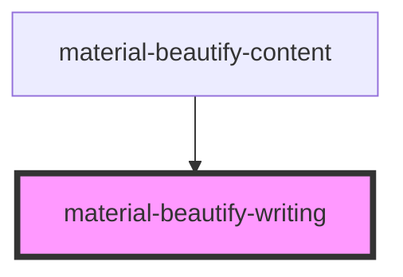

# material-beautify-chinese-study

<!-- Auto Generated Below -->

## Properties

| Property | Attribute | Description | Type     | Default     |
| -------- | --------- | ----------- | -------- | ----------- |
| `hanzi`  | `hanzi`   |             | `string` | `undefined` |
| `phonic` | `phonic`  |             | `string` | `undefined` |

## Dependencies

### Used by

 - [material-beautify-content](.)

### Graph

----------------------------------------------

*Built with [StencilJS](https://stenciljs.com/)*
